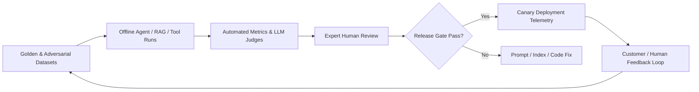
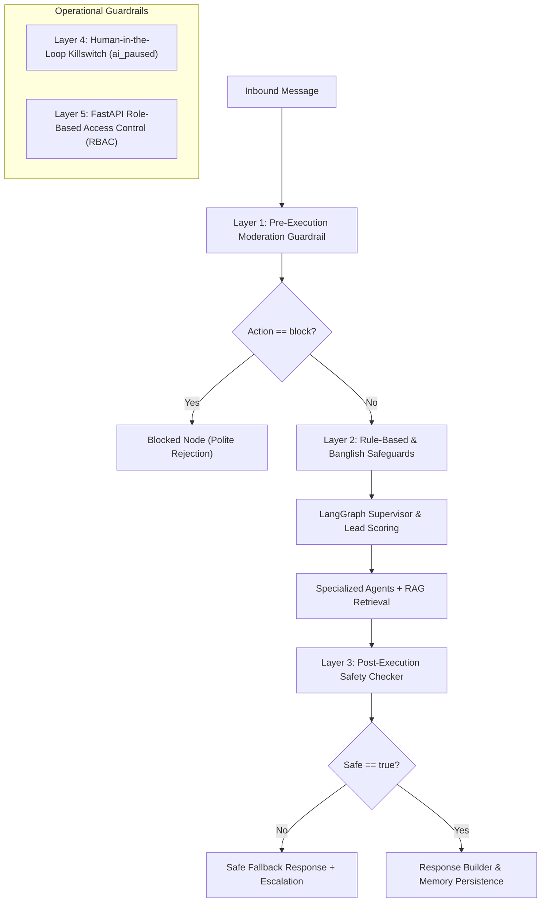
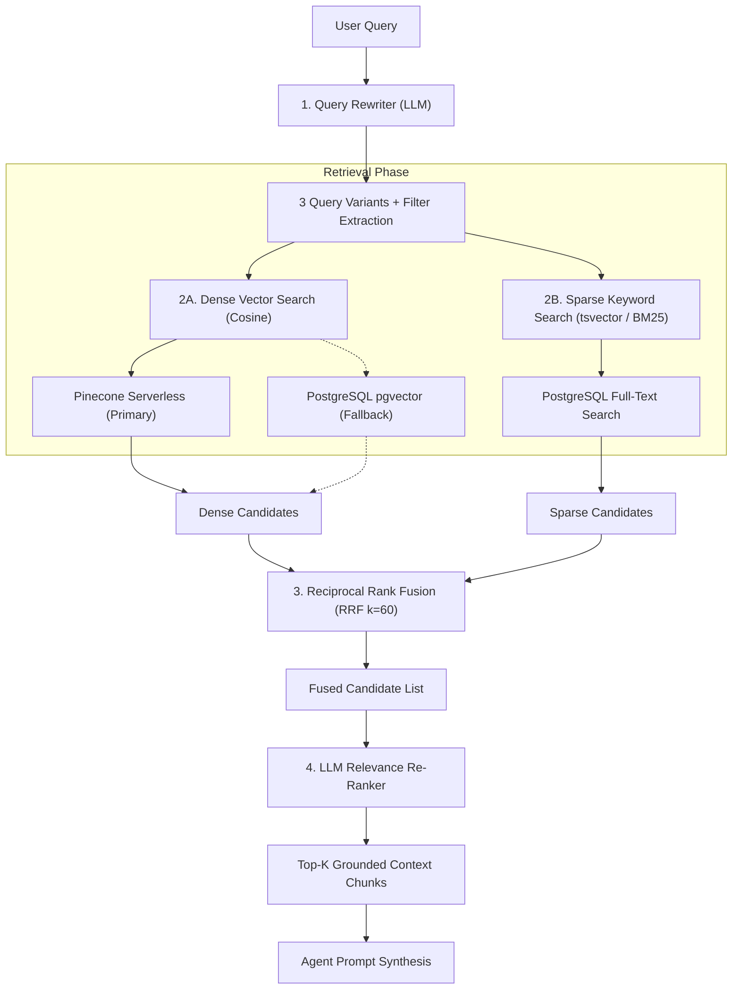
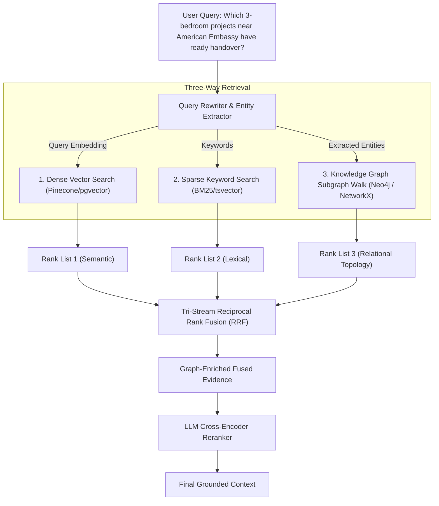

# 🔬 Technical Audit & Deep Dive: Evals, Guardrails, Memory & RAG Architecture

> **Project:** GLG Assets Real Estate AI Engagement & Automation Platform  
> **Date:** September 2026  
> **Status:** Codebase Audit & Architectural Analysis  
> **Target Audience:** Engineering Leads, AI Architects, Technical Evaluators  

---

## Executive Summary: Implementation Reality Matrix

Before diving into the technical details, the table below provides an honest, production-grounded assessment distinguishing between **what is actively running in the codebase**, **what is defined in architectural specifications**, and **what is not implemented**.

| Domain | Implemented in Active Codebase | Defined in Architecture Docs (`ai-architecture-document.md`) | Status / Verdict |
| :--- | :--- | :--- | :--- |
| **Evals (Evaluations)** | Pytest test suite (`test_knowledge_rbac.py`, `test_backend.py`, `test_chat_response_format.py`, `test_social_bridge.py`) | Offline golden datasets, Langfuse tracing, Groundedness (≥0.95), Hallucination rate (≤1%), Intent accuracy (≥95%) | **Code-level unit/integration tests active.** Continuous LLM-as-a-Judge (e.g., Ragas/DeepEval) is specified in architecture docs but not deployed as a live automated service. |
| **Guardrails** | Multi-layer: (1) Pre-execution LLM moderation (`moderation_node`), (2) Rule-based fast-paths & Banglish safeguards, (3) Post-execution safety checker (`safety_check_node`), (4) HITL killswitch (`ai_paused`), (5) FastAPI RBAC (`require_roles`) | PII masking (credit cards, NID), prompt injection defenses, token budgets, confirmation-before-mutation policy | **Fully active & enforced in code.** Multi-stage guardrails run on every turn in the LangGraph pipeline. |
| **Self-Correcting Memory** | Session-bounded sliding window (`ConversationMemory`, 20 turns, 24h TTL) + cross-turn entity persistence (`property_agent_node`) | Multi-tier memory (working, conversation, summary, profile, lead, semantic, episodic) with reflection loops | **Partial.** Session memory and cross-turn entity preservation exist. Autonomous "Self-Correcting / Reflexion" memory loops are designed in architecture diagrams but not running in code. |
| **RAG Architecture** | Multi-stage pipeline: LLM Query Rewriter + Pinecone/pgvector Dual Storage + BM25/tsvector Keyword Search + Reciprocal Rank Fusion (RRF) + LLM Cross-Reranker | Document versioning, BGE-M3 embeddings, quarantine ACLs, context compression | **Fully active & implemented in code** (`app/rag/`). |
| **GraphRAG vs. Rank Fusion** | **Reciprocal Rank Fusion (RRF)** fusing Dense Vector search + Sparse Keyword search; agent control flow orchestrated via **LangGraph** | Vector + Keyword RRF with Cross-Encoder reranking | **Rank Fusion is used (Vector + Keyword RRF).** **GraphRAG (Knowledge Graph triples/communities) is NOT used.** LangGraph is used for *agent state graph execution*, not GraphRAG. |

---

## 1. Evaluations (Evals)

### 1.1 What is Implemented in Code
The active backend repository (`backend/tests/`) contains deterministic integration and unit test suites:
- **RBAC & Knowledge Isolation Tests** ([`test_knowledge_rbac.py`](file:///d:/Softwear%20Project/Realstate%20Automation/backend/tests/test_knowledge_rbac.py)): Verifies that knowledge chunk uploads, vector searches, and document queries respect Role-Based Access Control and tenant scoping.
- **Backend Flow & Intent Tests** ([`test_backend.py`](file:///d:/Softwear%20Project/Realstate%20Automation/backend/tests/test_backend.py)): Validates chat response formats, memory preservation across turns, and escalation triggers.
- **Chat Response Format Verification** ([`test_chat_response_format.py`](file:///d:/Softwear%20Project/Realstate%20Automation/test_chat_response_format.py)): Ensures structured JSON outputs from LLM calls adhere to required schemas (avoiding downstream parser crashes).
- **Social Bridge & Lead Verification** ([`test_social_bridge.py`](file:///d:/Softwear%20Project/Realstate%20Automation/backend/tests/test_social_bridge.py)): Tests Meta (Facebook/Instagram) comment-to-DM routing and webhook ingestion.

### 1.2 What is Specified in Architecture Docs (`docs/architecture/ai-architecture-document.md`)
Section 10 of the AI Architecture Document specifies an enterprise-grade offline and online evaluation framework:



#### Architectural Target Metric Thresholds:
| Evaluation Metric | Target Threshold | Method / Tooling |
| :--- | :--- | :--- |
| **Intent Routing Accuracy** | $\ge 95\%$ | Golden labeled test dataset of user queries |
| **Groundedness Score** | $\ge 0.95$ | Claim entailment verification against retrieved context |
| **Hallucination Rate** | $\le 1\%$ | Critical domain claims unsupported by knowledge base |
| **Retrieval Quality** | Recall@5 $\ge 0.90$, nDCG $\ge 0.85$ | Evaluated against golden query-document pairs |
| **Deterministic Calculations**| $100\%$ | Payment installments must match math oracle exactly |
| **Tool Execution Success** | $\ge 98\%$ | Valid schema compliance and API return status |
| **Safety & Injection Block** | $100\%$ critical leaks | Adversarial jailbreak and prompt injection test set |

### 1.3 What is Missing for Full Production Evals
- An automated continuous framework like **Ragas** (measuring Faithfulness, Answer Relevance, Context Precision, Context Recall) or **DeepEval** is not yet plugged into CI/CD.
- Tracing via **Langfuse** is architecturally designed in Section 11 of the architecture spec, but currently logs are streamed via internal websockets ([`log_streamer.py`](file:///d:/Softwear%20Project/Realstate%20Automation/backend/app/services/log_streamer.py)) rather than an external Langfuse server.

---

## 2. Guardrails

The GLG Assets platform utilizes a **Defense-in-Depth Guardrail System** operating across multiple layers:



### 2.1 Layer 1: Pre-Execution Moderation Guardrail
Implemented in [`backend/app/agents/graph.py`](file:///d:/Softwear%20Project/Realstate%20Automation/backend/app/agents/graph.py#L22-L58):
- **Node**: `moderation_node`
- **Mechanism**: Before any agent or RAG retrieval occurs, the message is analyzed by an LLM prompt (`MODERATION_PROMPT`) for:
  - `is_spam`: Promotional spam or bot attacks.
  - `is_toxic`: Abusive language or hate speech.
  - `contains_pii`: Sensitive credit card or national identity numbers.
  - `is_inappropriate`: Off-topic harassment.
- **Routing**: If `action == "block"`, `moderation_router` immediately diverts execution to `blocked_node`, returning:
  > *"I'm sorry, but I can't process that message. Please keep our conversation respectful and on-topic."*
  This prevents unnecessary database queries, vector lookups, and token consumption.

### 2.2 Layer 2: Vernacular Fast-Path & Rule Safeguards
Implemented in [`backend/app/agents/graph.py`](file:///d:/Softwear%20Project/Realstate%20Automation/backend/app/agents/graph.py#L65-L96):
- **Direct Greeting Safeguard**: Deterministically intercepts common greetings (*"hi", "hello", "salam", "assalamu alaikum"*) to eliminate LLM hallucinations on basic conversational entrypoints.
- **Banglish & Bengali Property Safeguard**: Detects common Bengali/Banglish inquiries (*"ki ache", "konta ache", "flat ache", "dam koto"*) and location keywords (*"Banani", "Gulshan", "Uttara", "Dhanmondi"*), forcing intent classification to `property_search` with high confidence ($0.95$).

### 2.3 Layer 3: Post-Execution Output Safety Checker
Implemented in [`backend/app/agents/graph.py`](file:///d:/Softwear%20Project/Realstate%20Automation/backend/app/agents/graph.py#L333-L360):
- **Node**: `safety_check_node`
- **Mechanism**: Evaluates the generated response (`agent_reply`) before sending it to the client:
  ```python
  prompt = f"""You are a safety checker. Review this message for harmful or inappropriate content.
  Reply should be allowed for a real-estate customer communication channel.
  Message: "{state.agent_reply[:500]}"
  Respond with JSON: {{"safe": true, "reason": ""}} or {{"safe": false, "reason": "..."}}"""
  ```
- **Failsafe Action**: If `safe == false`, the AI response is replaced with:
  > *"I'm sorry, I couldn't generate an appropriate response. Let me connect you with a team member."*
  And `requires_escalation` is set to `True`.

### 2.4 Layer 4: Human Takeover (HITL) Guardrail
- Database field `ai_paused` in `conversations` table.
- When an agent or manager takes over a live chat in the dashboard, `ai_paused` is set to `true`.
- The backend suppresses all automated AI completions for that conversation until a human manually unpauses it.

### 2.5 Layer 5: Role-Based Access Control (RBAC) Guardrail
Implemented in [`backend/app/dependencies.py`](file:///d:/Softwear%20Project/Realstate%20Automation/backend/app/dependencies.py):
- High-order dependency `require_roles([UserRole.ADMIN, UserRole.MANAGER])` protects sensitive operations (knowledge base ingestion, email approvals, project modifications).
- Prevents unauthorized users or client-tier actors from injecting malicious documents into the vector database.

---

## 3. Self-Correcting Memory: Reality vs. Theory

### 3.1 What is Implemented in Code
1. **Sliding-Window Session Memory** ([`backend/app/services/memory.py`](file:///d:/Softwear%20Project/Realstate%20Automation/backend/app/services/memory.py)):
   - `ConversationMemory` stores user and assistant turns up to 20 turns (`_max_turns = 20`).
   - Time-To-Live (TTL) expiration of 24 hours (`_ttl = timedelta(hours=24)`).
   - Injected into prompt contexts for multi-turn dialogue continuity.
2. **Dynamic Entity Preservation Across Turns** ([`backend/app/agents/graph.py`](file:///d:/Softwear%20Project/Realstate%20Automation/backend/app/agents/graph.py#L167-L181)):
   - If a customer says *"Do you have any 3-bedroom units in Banani?"*, followed by *"What is the handover date?"*, the property agent inspects historical turns and carries forward `location = "Banani"` without requiring the user to re-specify it.

### 3.2 Does the Codebase Have "Self-Correcting Memory"?
**Strict Answer: No autonomous self-correcting / self-refining memory loop exists in the active code.**

In AI literature, **Self-Correcting Memory** (e.g., Reflexion, MemGPT, Self-RAG) refers to an agent architecture where:
1. An agent detects that a previous retrieved memory or fact produced an error or contradiction.
2. The agent executes a critique/reflection step.
3. The agent rewrites, updates, or tombstones the stored memory record in the database.

In this codebase:
- The LangGraph flow is **feed-forward / acyclic** (`moderation -> supervisor -> lead_scoring -> memory_load -> agent -> safety_check -> response_builder`).
- There is no cyclic feedback loop from `safety_check` or `response_builder` back into `memory_load` to rewrite historical memory.
- However, Section 2 of `docs/architecture/ai-architecture-document.md` specifies this target architecture:
  ```mermaid
  stateDiagram-v2
    Executing --> Reflecting
    Reflecting --> Executing: retry safe step / correct context
    Reflecting --> Responding: sufficient confidence
    Reflecting --> Handoff: unsafe or unresolved
  ```

---

## 4. What RAG Architecture is Used?

The codebase implements an **Enterprise Hybrid RAG Pipeline** with LLM Query Expansion, Dual Storage, Reciprocal Rank Fusion, and LLM Re-ranking.



### 4.1 Step 1: Query Rewriting & Metadata Filter Extraction
Implemented in [`backend/app/rag/query_rewriter.py`](file:///d:/Softwear%20Project/Realstate%20Automation/backend/app/rag/query_rewriter.py):
- Uses `llm_service.structured_chat` with temperature `0.3`.
- Generates:
  1. **3 search-optimized query variants** to overcome vocabulary mismatch.
  2. **Structured metadata filters**: `project`, `location`, `document_type`.
  3. **Keyword tokens** for full-text indexing.

### 4.2 Step 2: Storage & Indexing Strategy
Implemented in [`backend/app/rag/vector_store.py`](file:///d:/Softwear%20Project/Realstate%20Automation/backend/app/rag/vector_store.py):
- **Primary Vector Store**: **Pinecone Serverless** (`PineconeVectorStore`), using cosine similarity and metadata filtering.
- **Secondary / Local Vector Store**: **PostgreSQL `pgvector`** (`PgVectorStore`):
  ```sql
  SELECT c.id, c.doc_id, c.chunk_index, c.content, c.filename,
         c.project, c.location, c.document_type, c.metadata,
         1 - (c.embedding <=> CAST(:emb AS vector)) AS score
  FROM knowledge_chunks c
  WHERE c.embedding IS NOT NULL AND c.project = :project
  ORDER BY score DESC LIMIT :limit;
  ```
- **Embedding Model**: OpenAI `text-embedding-3-small` (1536 dimensions).
- **Chunking Configuration**: Recursive character chunking:
  - Target size: 500 tokens ($\approx 2,000$ characters).
  - Overlap: 50 tokens ($\approx 200$ characters).
  - Separators: `\n\n`, `\n`, `. `, ` `.

### 4.3 Step 3: Sparse Keyword Retrieval
- Built on PostgreSQL full-text search:
  ```sql
  SELECT c.id, c.doc_id, c.chunk_index, c.content,
         ts_rank(c.content_tsv, plainto_tsquery('english', :query)) AS score
  FROM knowledge_chunks c
  WHERE c.content_tsv @@ plainto_tsquery('english', :query)
  ORDER BY score DESC LIMIT :limit;
  ```

### 4.4 Step 4: Reciprocal Rank Fusion (RRF)
Implemented in [`backend/app/rag/reranker.py`](file:///d:/Softwear%20Project/Realstate%20Automation/backend/app/rag/reranker.py#L10-L34):
Dense vector search excels at high-level semantic concept matching, while sparse keyword search excels at exact proper nouns (e.g., project names like *"Gulshan Heights"*, unit numbers like *"4B"*). 

The results are combined using the standard **Reciprocal Rank Fusion formula**:
$$\text{RRF Score}(d) = \sum_{m \in M} \frac{w_m}{k + \text{rank}_m(d)}$$
Where:
- $k = 60$ (smoothing constant preventing top ranks from disproportionately dominating).
- $\text{rank}_m(d)$ is the 1-based rank position of document $d$ in system $m$.
- $w_m = 0.5$ (balanced weighting between dense vector and sparse keyword streams).

### 4.5 Step 5: LLM Relevance Re-Ranking
Implemented in [`backend/app/rag/reranker.py`](file:///d:/Softwear%20Project/Realstate%20Automation/backend/app/rag/reranker.py#L51-L100):
- If the candidate set exceeds `top_k` and has $> 5$ candidates, the system invokes `Reranker.rerank()`.
- An LLM cross-scorer grades each chunk on relevance from $0.0$ to $1.0$.
- Any chunk scoring below $0.5$ is strictly discarded.
- Remaining chunks are sorted by score, and only the top $K$ (default: 3) are injected into the agent's context window.

---

## 5. Did You Use GraphRAG or Graph-Enriched Retrieval via Rank Fusion?

### 5.1 The Direct Answer
1. **Did you use GraphRAG?**  
   **No.** The project does **not** use GraphRAG. It does not construct a Knowledge Graph of entities and relations (e.g., `(Project)-[:LOCATED_IN]->(City)`), extract graph communities (Leiden algorithm), or query a graph database like Neo4j or Amazon Neptune.
2. **Did you use Graph-Enriched Retrieval via Rank Fusion?**  
   **No.** What the codebase implements is **Hybrid Dense-Vector + Sparse-Keyword Retrieval via Reciprocal Rank Fusion (RRF)**. It fuses Vector Ranks and Full-Text Search (BM25) Ranks, not Graph Traversal Ranks.

### 5.2 Where Does "Graph" Appear in the Codebase?
The term "Graph" in this repository refers to **LangGraph**:
- **LangGraph** ([`backend/app/agents/graph.py`](file:///d:/Softwear%20Project/Realstate%20Automation/backend/app/agents/graph.py)) is an **orchestration state machine** that controls how agents, guardrails, and routers pass control between nodes.
- **LangGraph is NOT GraphRAG**. 
  - *LangGraph* = Agent workflow execution graph (Code control flow).
  - *GraphRAG* = Data retrieval from an Entity-Knowledge Graph (Information retrieval).

### 5.3 Comparison: What We Have vs. GraphRAG vs. Graph-Enriched Rank Fusion

| Feature | Current GLG Assets Implementation | GraphRAG (Microsoft Architecture) | Graph-Enriched Rank Fusion |
| :--- | :--- | :--- | :--- |
| **Underlying Data Store** | PostgreSQL 16 + Pinecone Serverless | Neo4j / NetworkX / Graph DB | Graph DB + Vector Index + BM25 |
| **Data Representation** | Text chunks + 1536-dim vector embeddings | Entities, Relationships, Community Summaries | Triples `(h, r, t)` + Vectors + Tokens |
| **Search Mechanism** | Dense Cosine Sim + Postgres `tsvector` Keyword | Graph traversal + Community summary retrieval | 3-way: Vector Sim + BM25 + Pagerank/Graph Walk |
| **Fusion Technique** | **Reciprocal Rank Fusion (Vector + Keyword)** | Hierarchical community aggregation | **RRF fusing (Vector + Keyword + Graph Ranks)** |
| **Best Used For** | Accurate Q&A against PDFs, brochures, price sheets | Global holistic queries (*"What are the main themes across all projects?"*) | Complex multi-hop relational reasoning |

### 5.4 How Graph-Enriched Retrieval Could Be Added
If GLG Assets wishes to upgrade to true **Graph-Enriched Retrieval via Rank Fusion**, the recommended architectural blueprint is:



$$\text{RRF Score}_{\text{Graph-Enriched}}(d) = \frac{w_v}{60 + \text{rank}_v(d)} + \frac{w_k}{60 + \text{rank}_k(d)} + \frac{w_g}{60 + \text{rank}_g(d)}$$

---

## 6. Summary Conclusion & Recommendations

1. **Evals**: Unit/integration tests are active in `backend/tests/`. The full benchmark framework (Ragas, golden test suites, Langfuse telemetry) is architecturally documented in `docs/architecture/ai-architecture-document.md` and recommended for Sprint 2 CI/CD automation.
2. **Guardrails**: **Fully implemented and robust.** The codebase enforces pre-execution moderation, vernacular Banglish regex/heuristic rules, post-execution safety checking, human-takeover killswitches, and FastAPI role-based access control.
3. **Self-Correcting Memory**: The codebase currently uses sliding-window memory with cross-turn entity carrying. Autonomous reflection loops (self-critique of memory) exist as design specifications in the architecture docs, not yet as live recursive code.
4. **RAG**: The system uses a **production-grade Hybrid RAG pipeline** featuring LLM Query Expansion, Dual Storage (Pinecone + pgvector), PostgreSQL full-text search, Reciprocal Rank Fusion (RRF), and LLM Re-ranking.
5. **GraphRAG vs. Rank Fusion**: The system uses **Rank Fusion (Reciprocal Rank Fusion)** between dense vectors and sparse keywords. It does **not** use GraphRAG or graph-traversal rank fusion. LangGraph is used exclusively for agent workflow control.
