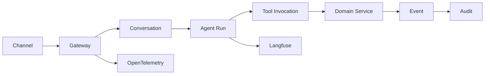

# Shared Architecture Contracts

**Status:** Baseline v1.0 · **Owners:** Platform Architecture and AI Architecture · **Last reviewed:** 2026-07-22

This document is the normative vocabulary and contract baseline for the System Architecture Specification (SAS) and AI Architecture Document (AAD). The SAS owns runtime service and infrastructure behavior; the AAD owns model, agent, retrieval, memory, and evaluation behavior. When either document needs a concept defined here, it references this document rather than redefining it.

## 1. Platform vision and principles

The platform provides a trustworthy, multilingual real-estate customer engagement capability across WhatsApp, Facebook Messenger, Instagram, website chat, and future voice channels. It combines authoritative transactional services, governed AI reasoning, enterprise knowledge retrieval, and human operations without treating generated text as a system of record.

### 1.1 Design principles

1. **Authoritative truth:** PostgreSQL-backed domain services own customer, project, unit, booking, payment, and lead state. ERP remains authoritative for explicitly designated replicated ERP fields. Retrieval indexes, caches, model output, memories, analytics, and audit records are not transactional truth.
2. **Contract-first boundaries:** Every synchronous API, event, tool, and AI run is versioned, correlated, authorized, observable, and idempotent where it can cause a side effect.
3. **Least privilege:** Tenant, customer, role, purpose, and consent scopes are evaluated before retrieval, tool execution, memory access, and human transfer.
4. **Async by default:** Cross-context workflows use RabbitMQ events and outbox/inbox processing; synchronous calls are reserved for customer-facing reads, commands requiring immediate confirmation, and bounded orchestration steps.
5. **Grounded assistance:** Claims about company policy, inventory, price, availability, payment, or construction status require a permitted source or an authorized tool result. Unsupported claims are qualified or refused.
6. **Human control:** Side effects require typed tools, policy checks, idempotency keys, and approval rules. Low confidence, safety concerns, customer request, or operational exceptions can transfer to a human with a complete context package.
7. **Evolution without channel coupling:** Channel adapters normalize inbound and outbound messages to the canonical conversation model; voice adds media and turn-taking semantics without changing domain contracts.
8. **Observable by design:** `trace_id`, `correlation_id`, `conversation_id`, and `agent_run_id` flow through gateways, services, events, tools, model providers, Langfuse, and audit storage.

### 1.2 Target capacity and initial SLO assumptions

| Dimension | Design target | Architectural implication |
|---|---:|---|
| Registered users | 1,000,000 | Tenant-aware identity, partitionable customer data, asynchronous analytics |
| Source documents | 10,000,000 | Object-store source of truth, incremental ingestion, durable indexing jobs |
| Embeddings | 100,000,000 | Partitioned/vector-indexed retrieval, metadata filtering, background compaction |
| Concurrent conversations | 100,000 | Stateless gateway/workers, Redis checkpoints, queue backpressure, model admission control |
| Peak inbound events | 5,000 events/s initial envelope | Provider-specific adapters, deduplication, partitioned queues, autoscaling |
| Read API availability | 99.95% monthly | Multi-zone deployment, health-based routing, graceful degradation |
| Command API availability | 99.9% monthly | Idempotent commands, durable outbox, reconciliation with ERP |
| Conversation first response | p95 ≤ 2 s excluding provider/model wait | Streaming, fast intent path, cached context, admission budgets |
| Grounded answer completion | p95 ≤ 8 s | Parallel retrieval/tools, bounded retries, model routing tiers |
| RAG retrieval | p95 ≤ 700 ms | Hybrid search, precomputed embeddings, Redis result cache |
| Recovery point objective | ≤ 5 minutes | Multi-zone WAL/object replication and durable event publishing |
| Recovery time objective | ≤ 60 minutes | Reprovisionable Kubernetes workloads and tested restore runbooks |

These are architecture baselines, not a promise that every provider or external ERP meets them. Each service publishes its measured SLO and dependency budget in the SAS.

## 2. Bounded contexts and ownership

| Bounded context | Primary owner | Authoritative aggregates | Main interfaces |
|---|---|---|---|
| Identity and access | Authentication Service | Tenant, user, role, consent | OAuth/OIDC, JWT, policy decision |
| Conversation | Conversation Service | Conversation, message, channel session | REST, WebSocket, streaming, events |
| AI runtime | AI Orchestrator | Agent run, plan, tool invocation | LangGraph state, tool gateway, traces |
| Knowledge | Knowledge Service | Source, document, document version, chunk | ingestion API, index events |
| Retrieval | Search/RAG Services | Search request/result, retrieval policy | hybrid search API |
| Property and inventory | Property Service | Project, unit, availability snapshot | search/read APIs, inventory events |
| CRM | CRM Service | Lead, qualification, assignment | lead APIs, CRM events |
| ERP integration | ERP Integration Service | Sync cursor, mapping, reconciliation | adapters, sync events |
| Booking and scheduling | Booking Service | Appointment, booking | command APIs, calendar adapters |
| Payments | Payment Service | Payment plan, quote, payment status | calculation/command APIs |
| Location | Maps Service | Geospatial query result | nearby search API |
| Media | Media Service | Asset, delivery job | signed URLs, media events |
| Notification | Notification Service | Notification, delivery attempt | channel providers, delivery events |
| Workflow | Workflow Service | Workflow execution | n8n integration, workflow events |
| Analytics | Analytics Service | Facts, dimensions, aggregate metrics | event consumers, reporting APIs |
| Audit | Audit Service | Audit record, access record | append-only ingestion/query |
| Administration | Admin Service | Configuration, policy, prompt/model metadata | administrative APIs |

Services may maintain read models or caches, but ownership means the context validates and changes its authoritative aggregates. AI agents never access databases directly; they invoke authorized tools owned by these contexts.

## 3. Canonical entities and identifiers

All identifiers are opaque UUIDv7 values encoded as lowercase strings unless an external identifier is explicitly labeled. Every entity includes `tenant_id`, `created_at`, `updated_at`, and `version` where applicable.

| Entity | Required identity fields | Authority |
|---|---|---|
| Customer | `customer_id`, optional `external_refs`, consent status | CRM/Identity |
| Conversation | `conversation_id`, `customer_id`, `channel`, lifecycle state | Conversation |
| Message | `message_id`, `conversation_id`, direction, content type, provider message ID | Conversation |
| Lead | `lead_id`, `customer_id`, source, stage, owner | CRM |
| Project | `project_id`, marketing identity, location, status | Property/ERP mapping |
| Unit | `unit_id`, `project_id`, inventory status, price version | Property/ERP mapping |
| Booking | `booking_id`, `customer_id`, target, status, idempotency key | Booking |
| Payment plan | `payment_plan_id`, terms, currency, calculation version | Payment |
| Document | `document_id`, source, classification, lifecycle state | Knowledge |
| Knowledge chunk | `chunk_id`, `document_version_id`, text, metadata, embedding version | Knowledge/Search |
| Tool invocation | `tool_invocation_id`, tool name/version, agent run, status | AI Orchestrator |
| Agent run | `agent_run_id`, conversation, parent run, model/policy versions | AI Orchestrator |
| Handoff | `handoff_id`, conversation, reason, summary, status | Conversation/CRM |

### 3.1 Security and data classifications

Every payload and stored field is classified as `PUBLIC`, `INTERNAL`, `CONFIDENTIAL`, or `RESTRICTED_PII`. `RESTRICTED_PII` includes identity documents, payment details, authentication data, precise contact data, and sensitive free text. Classification travels in event metadata, controls log redaction, and determines retention and export rules. Tenant isolation is mandatory for all non-public data, including vector metadata and memory.

## 4. API contract conventions

### 4.1 HTTP and streaming

- Base path: `/api/v1`; breaking changes create `/api/v2` and coexist through the published deprecation window.
- JSON uses `camelCase`; timestamps are RFC 3339 UTC; money uses integer minor units plus ISO 4217 currency; locale uses BCP 47.
- `GET` reads are safe; `POST` commands require `Idempotency-Key`; `PUT` replaces; `PATCH` applies validated partial updates; `DELETE` is soft-delete unless explicitly documented.
- Pagination uses opaque `nextCursor` and bounded `pageSize` (default 25, maximum 100). Search responses include `freshness`, `source`, and `authorizationScope` metadata.
- WebSocket and server-sent events use the same envelope with `type`, `sequence`, `conversationId`, and resumable `lastEventId`. Clients must tolerate duplicate events and reconnect.
- Request headers: `Authorization`, `X-Tenant-Id` (validated against claims), `X-Correlation-Id` (accepted or generated), `X-Client-Version`, and optional `Accept-Language`.

### 4.2 Error envelope

```json
{
  "error": {
    "code": "BOOKING_SLOT_UNAVAILABLE",
    "message": "The requested appointment slot is no longer available.",
    "category": "CONFLICT",
    "retryable": false,
    "details": [],
    "correlationId": "01J...",
    "timestamp": "2026-07-22T12:00:00Z"
  }
}
```

Stable `code` values are machine-consumable; `message` is safe for the caller and never contains secrets or unmasked PII. Categories are `VALIDATION`, `AUTHENTICATION`, `AUTHORIZATION`, `NOT_FOUND`, `CONFLICT`, `RATE_LIMITED`, `DEPENDENCY`, and `INTERNAL`. Retryable errors include `Retry-After` when appropriate.

## 5. Event contract

Events are immutable facts, published through RabbitMQ exchanges and persisted by the producer outbox before acknowledgement. Consumers use an inbox keyed by `event_id`; ordering is guaranteed only per `aggregate_id` and event stream partition.

```json
{
  "eventId": "01J...",
  "eventType": "LeadCreated",
  "schemaVersion": "1.0",
  "occurredAt": "2026-07-22T12:00:00Z",
  "tenantId": "01J...",
  "aggregateType": "Lead",
  "aggregateId": "01J...",
  "aggregateVersion": 4,
  "actor": { "type": "AI_TOOL", "id": "01J..." },
  "correlationId": "01J...",
  "causationId": "01J...",
  "traceId": "4bf...",
  "piiClassification": "CONFIDENTIAL",
  "dataContract": "crm.lead.v1",
  "payload": {}
}
```

Canonical event names include `ConversationStarted`, `MessageReceived`, `MessageDelivered`, `AgentRunStarted`, `ToolInvocationCompleted`, `LeadCreated`, `BookingCreated`, `AppointmentBooked`, `PaymentReceived`, `BrochureSent`, `HumanTransferRequested`, `KnowledgeUpdated`, `InventoryUpdated`, `ERPUpdated`, and `ConversationEnded`. A consumer must tolerate duplicates, late events, unknown optional fields, and redelivery.

## 6. Tool contract conventions

Tools are versioned capabilities, not unrestricted function calls. Each registration contains JSON Schema input/output, owning service, required authorization scope, side-effect classification, timeout, retry policy, cache policy, freshness requirement, audit policy, and evaluation fixtures.

```json
{
  "name": "SearchInventory",
  "version": "1.0",
  "scope": "property.inventory.read",
  "sideEffect": "NONE",
  "inputSchema": { "type": "object", "required": ["projectIds"] },
  "timeoutMs": 1200,
  "retry": { "maxAttempts": 2, "backoffMs": 100 },
  "cache": { "enabled": true, "maxAgeSeconds": 30 },
  "requiresAudit": true
}
```

Side-effect classes are `NONE`, `REVERSIBLE`, `IRREVERSIBLE`, and `EXTERNAL_COMMIT`. `REVERSIBLE` and stronger require idempotency and a policy decision; `EXTERNAL_COMMIT` may require explicit customer confirmation or human approval. Tool results include `resultStatus`, `sourceAt`, `expiresAt`, `authorizationScope`, and `warnings`.

## 7. Correlation, idempotency, and traceability

The gateway generates missing `correlation_id` and `trace_id`. A conversation has one stable `conversation_id`; each model workflow has an `agent_run_id`; each model/tool attempt has a child span and optional `tool_invocation_id`. Events propagate `correlation_id` and `causation_id`. Side-effecting requests require a client or orchestrator-generated `idempotency_key`, scoped to tenant, operation, and actor, with a minimum 24-hour retention window.

The trace chain is:



## 8. State machines

Conversation states are `NEW → ACTIVE → WAITING_FOR_CUSTOMER → HANDOFF_PENDING → HUMAN_ACTIVE → RESOLVED → CLOSED`, with `ABANDONED` reachable from inactive states. Booking states are `REQUESTED → PENDING_CONFIRMATION → CONFIRMED`, with `CANCELLED`, `EXPIRED`, and `FAILED` terminal alternatives. Agent runs are `CREATED → PLANNING → EXECUTING → REFLECTING → RESPONDING → COMPLETED`, with `WAITING`, `HANDOFF`, `FAILED`, and `CANCELLED` exits.

Illegal transitions return a conflict error and are recorded in audit logs. State changes emit a versioned event and use optimistic concurrency on `version`.

## 9. Cross-document traceability

| Requirement | SAS reference | AAD reference | Shared contract |
|---|---|---|---|
| Authoritative inventory | Property Service | Inventory/search tools | Entity authority and freshness |
| Lead creation | CRM Service, `LeadCreated` | CRM and lead qualification agents | Tool/event/idempotency |
| Grounded answers | RAG/Search services | RAG pipeline and citations | Classification and trace IDs |
| Human escalation | Conversation/CRM services | Handoff policy and summary | Handoff entity/state |
| Async consistency | Event architecture | Tool/event observation | Event envelope |
| Operational SLOs | Reliability/operations | AI latency and evaluation | Target capacity table |

Changes to this document require review from both SAS and AAD owners. Contract changes are additive by default, require schema versioning, migration notes, consumer compatibility tests, and an updated traceability table.