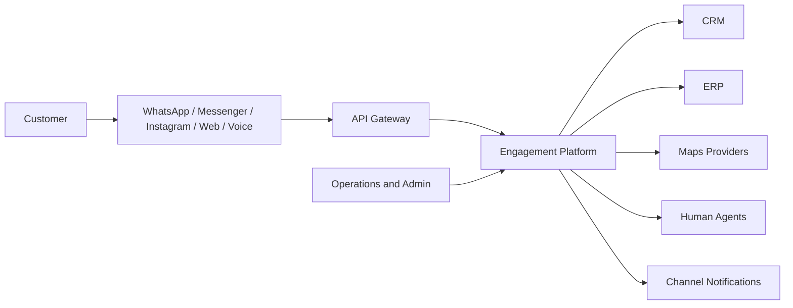
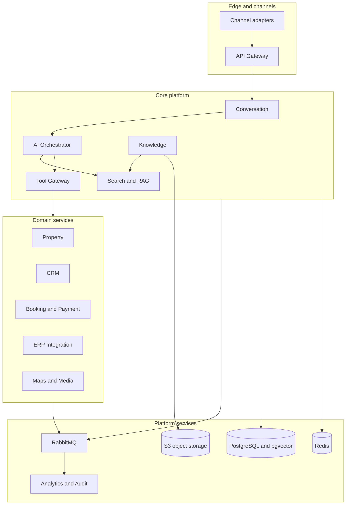
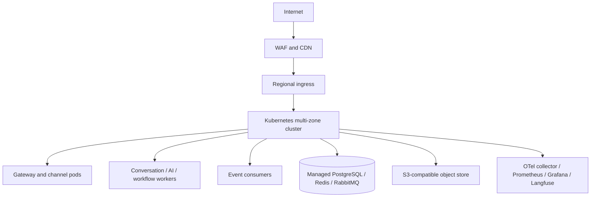
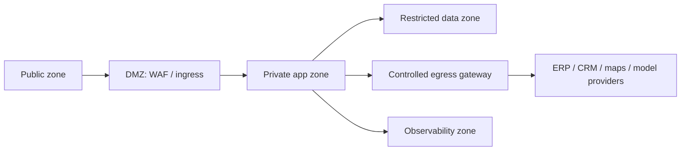
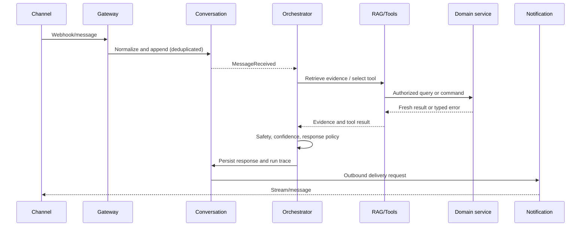
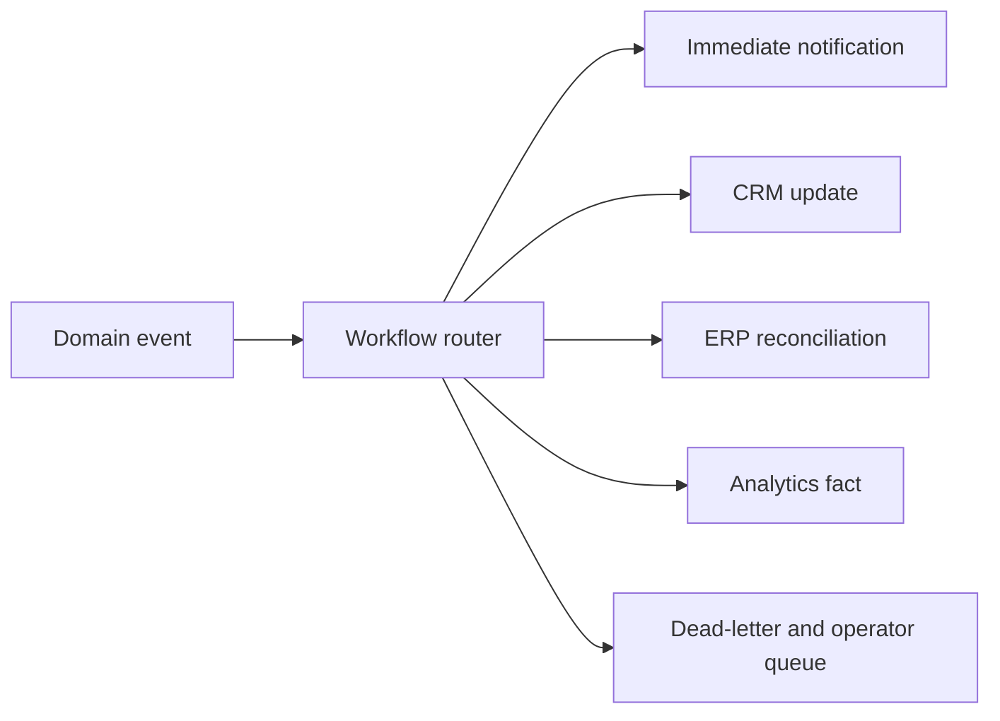

# System Architecture Specification (SAS)

**Version:** 1.0 · **Status:** Implementation baseline · **Date:** 2026-07-22  
**Companion:** [AI Architecture Document](ai-architecture-document.md) · **Normative contracts:** [Shared Architecture Contracts](shared-contracts.md)

## 1. Executive summary

The AI Real Estate Customer Engagement Platform is a multi-tenant, cloud-native system that presents one governed customer experience across WhatsApp, Facebook Messenger, Instagram, web chat, and a future voice adapter. Channel adapters normalize provider traffic into the Conversation bounded context. The platform then combines domain services, enterprise retrieval, an AI orchestrator, deterministic tools, event-driven workflows, analytics, audit, and human operations.

This is not a chatbot deployment. Transactional services remain authoritative for inventory, bookings, payments, customers, and leads. AI can interpret, retrieve, plan, and recommend, but it can only change state through authorized, typed, idempotent tools. The platform is designed for 1 million users, 10 million source documents, 100 million embeddings, 100,000 concurrent conversations, 50+ tools, and 20+ agents.

### 1.1 Architectural goals

- Deliver grounded, multilingual answers with citations or source freshness where appropriate.
- Keep provider-specific channel and ERP behavior behind hexagonal adapters.
- Scale stateless synchronous traffic independently from model, retrieval, ingestion, and workflow workers.
- Preserve tenant isolation, consent, PII controls, auditability, and human override at every boundary.
- Support gradual rollout by capability, channel, tenant, model, and service version.

### 1.2 Non-goals and constraints

The baseline does not implement application code, production prompts, infrastructure manifests, model fine-tuning, or channel-provider onboarding. Cloud selection remains portable; the recommended reference stack is Docker/Kubernetes, FastAPI, PostgreSQL/pgvector, Redis, RabbitMQ, S3-compatible storage, n8n, OpenTelemetry, Prometheus, Grafana, and Langfuse.

## 2. System context

### 2.1 Primary flows

1. A webhook or web/voice session is authenticated, deduplicated, rate-limited, normalized, and appended to a conversation.
2. The conversation service emits `MessageReceived`; the orchestrator loads policy-scoped state, memory, and context.
3. The AI runtime selects a worker agent and invokes read or side-effect tools through the tool gateway.
4. Domain services return authoritative results. Side effects write local state and an outbox record in one transaction.
5. The response is safety-checked, cited where required, streamed through the channel adapter, persisted, and observed.
6. Events feed CRM, notifications, workflows, analytics, audit, and reconciliation consumers.

## 3. Container architecture

### 3.1 Deployment topology

Use at least three availability zones for production. Public ingress is isolated from private services. Data services use private endpoints, network policies, encrypted volumes, automated backups, and separate credentials. A second region is warm standby for critical APIs and asynchronous recovery unless a tenant contract requires active-active operation.

### 3.2 Network zones

Network policies deny by default. Only gateway-to-conversation, orchestrator-to-tool-gateway, service-to-owned-store, event-consumer-to-broker, and approved egress paths are allowed. Administrative access uses short-lived identity, a bastion or zero-trust proxy, MFA, and audited sessions.

## 4. Service architecture

All services use clean/hexagonal architecture: inbound adapters (HTTP, events, scheduled jobs), application services/use cases, domain model/policies, outbound ports, and repository/adapters. Controllers validate transport contracts; service layers enforce use-case authorization and transactions; repositories cannot be called by agents or other contexts directly.

### 4.1 Service catalog

| Service | Responsibilities and owned data | Inputs / outputs | Events and dependencies | Scale, cache, failure |
|---|---|---|---|---|
| API Gateway | TLS termination, routing, auth context, quotas, webhooks, streaming | REST/WebSocket/SSE, normalized envelopes | Emits request/access facts; Auth, Conversation, Redis | Stateless HPA; short response cache; shed load with `RATE_LIMITED` |
| Authentication | OIDC, JWT, tenant membership, roles, consent | Login/token/introspection | User/tenant policy store; identity provider | Replicated, key cache; deny on uncertainty |
| Conversation | Conversations, messages, channel sessions, lifecycle | Inbound message to outbound stream | `ConversationStarted`, `MessageReceived`, `ConversationEnded`; PostgreSQL, Redis, broker | Partition by conversation; Redis hot state; durable append and replay on broker failure |
| AI Orchestrator | LangGraph runs, policy routing, checkpoints, model budgets | Conversation context to response/tool requests | Agent/run/tool events; LiteLLM, RAG, Tool Gateway, Redis | Worker pools and queue admission; checkpoint cache; retry/fallback/handoff |
| RAG | Retrieval policy, hybrid query, rerank, citations | Scoped query to evidence set | Retrieval traces; Search, pgvector, Redis | Read replicas and index partitions; empty/low-quality evidence is explicit |
| Knowledge | Source registration, documents, versions, ACL metadata | Upload/connector/index status | `KnowledgeUpdated`; S3, Embedding, Search, broker | Ingestion queue autoscaling; immutable versions; quarantine bad documents |
| Embedding | Chunk embedding jobs and model version lifecycle | Chunk batches to vectors | `EmbeddingCompleted`; LiteLLM/BGE-M3, pgvector | Batch workers, backpressure; retry provider failures, retain old index |
| Search | Keyword/vector indexes and result ranking | Filtered search to ranked IDs | Index status; PostgreSQL/pgvector/OpenSearch-compatible adapter | Partition by tenant/domain; Redis query cache; stale-index warning |
| Property | Projects, units, inventory snapshots, pricing reads | Search/query/availability commands | `InventoryUpdated`, `ProjectUpdated`; ERP adapter | Read replicas and short TTL cache; never claim stale availability as current |
| CRM | Customers, leads, qualification, ownership | Lead create/update/query | `LeadCreated`, `LeadUpdated`; CRM connector, PostgreSQL | Idempotent command writes; queue retry and reconciliation |
| ERP Integration | Mapping, sync cursors, outbound commands, reconciliation | ERP pull/push and normalized changes | `ERPUpdated`, `ERPSyncFailed`; ERP APIs, broker | Per-tenant rate limits; circuit breaker, dead-letter, compensating reconciliation |
| Booking | Appointment slots, booking state, calendar integration | Availability and booking commands | `BookingCreated`, `AppointmentBooked`, `BookingCancelled`; CRM, calendar | Pessimistic/optimistic slot lock; idempotency; saga on calendar failure |
| Payment | Deterministic payment plans, quotes, payment status mapping | Calculation and authorized payment commands | `PaymentPlanCalculated`, `PaymentReceived`; ERP/payment provider | Stateless calculations; versioned price inputs; fail closed on missing terms |
| Maps | Geocoding and nearby places | Location query to normalized results | Provider usage facts; maps providers | Geohash cache with freshness; provider fallback and bounded timeout |
| Media | Asset metadata, signed URLs, brochure generation jobs | Upload/generate/deliver | `BrochureGenerated`, `BrochureSent`; S3, templates, Notification | Object-store durability; async generation and retry |
| Notification | Delivery templates, channel dispatch, attempts | Outbound message and status | `MessageDelivered`, `MessageDeliveryFailed`; adapters | Per-provider queues and quotas; retry with deduplication |
| Workflow | Long-running business workflows and n8n integration | Event/command workflow triggers | Workflow lifecycle events; RabbitMQ, n8n | Durable execution IDs; resume from checkpoint, dead-letter failures |
| Analytics | Event facts, conversation and funnel metrics | Event streams and reporting queries | Consumes all approved events; warehouse/OLAP | Separate compute/storage; late-event correction and PII minimization |
| Audit | Immutable security, tool, data access, and state records | Signed audit envelopes | Consumes audit-required events; append-only store | Write-optimized partitioning; alert on loss, never delete before retention |
| Admin | Tenant config, policies, feature flags, prompt/model metadata | Authenticated admin commands | `PolicyChanged`, `ConfigChanged`; Audit, Auth | Small replicated store; two-person approval for high-risk policies |
| Monitoring | Health, SLOs, traces, alerts, replay tooling | OTel/log/metric streams | Prometheus, Grafana, Langfuse, alert manager | Collectors buffer locally; dashboards degrade without affecting serving |

### 4.2 API surface baseline

Representative APIs use `/api/v1` and the shared error envelope:

| Resource | Endpoints | Notes |
|---|---|---|
| Conversations | `POST /conversations`, `GET /conversations/{id}`, `POST /conversations/{id}/messages`, `GET /conversations/{id}/stream` | Customer-scoped; stream resumable |
| Projects | `GET /projects`, `GET /projects/{id}`, `POST /projects/search` | Filter by tenant, locale, budget, location, status |
| Inventory | `POST /inventory/search`, `GET /units/{id}` | Freshness and source required |
| Leads | `POST /leads`, `PATCH /leads/{id}`, `GET /leads/{id}` | Idempotent create and CRM reconciliation |
| Bookings | `GET /appointments/slots`, `POST /bookings`, `POST /bookings/{id}/cancel` | Confirmation and idempotency required |
| Knowledge | `POST /knowledge/sources`, `POST /knowledge/documents`, `GET /knowledge/jobs/{id}` | Admin scope and ACL propagation |
| Operations | `GET /health/live`, `GET /health/ready`, `GET /metrics`, `POST /reconciliation/{context}` | Internal/admin only except health |

## 5. Conversation and automation flows

Automation workflows must have a durable execution ID, tenant scope, timeout, retry policy, compensation action, and operator visibility. n8n is an integration/orchestration adapter, not the authority for domain state.

## 6. Data architecture

| Store | System role | Required controls |
|---|---|---|
| PostgreSQL | Authoritative service schemas, outbox/inbox, read models | Per-service schema/role, PITR, replicas, RLS where suitable, migrations |
| pgvector | Embeddings and retrieval metadata | Tenant/ACL filters before ranking, versioned indexes, rebuildable data |
| Redis | Session state, LangGraph checkpoints, rate limits, hot cache, locks | TTLs, encryption, no sole source of truth, bounded memory/eviction policy |
| RabbitMQ | Durable event and work delivery | Quorum queues, publisher confirms, DLX, per-tenant fairness, monitoring |
| S3-compatible | Source documents, media, exports, backups | Versioning, object lock for audit artifacts, malware scan, signed URLs |
| Analytics store | Aggregated product, funnel, and AI metrics | Minimized PII, separate credentials, late-event correction |
| Audit store | Immutable access, policy, tool, and state evidence | Append-only, hash chaining or WORM, restricted query role, retention policy |

Operational records are never reconstructed from analytics, vectors, cache, or generated text. Every index row includes source entity/version, ACL metadata, embedding version, and indexed timestamp. Deletion requests propagate to caches, vectors, object derivatives, memory, analytics identifiers, and audit according to legal retention rules.

## 7. Security architecture

- **Identity:** OIDC for human/admin identities; short-lived JWT access tokens; service identities via workload identity and mTLS where supported.
- **Authorization:** RBAC plus tenant, resource, purpose, consent, and data-classification attributes. Policy is checked at gateway, service, retrieval, memory, tool, and handoff boundaries.
- **Encryption:** TLS 1.3 in transit; managed-key encryption at rest; field-level encryption/tokenization for restricted PII; no secrets in logs, prompts, traces, or events.
- **Secrets:** Central secret manager, workload-specific access, rotation, expiry alarms, and emergency revocation. Model and provider keys are never sent to clients.
- **PII:** Detect and classify inbound text/media, mask observability fields, minimize prompt context, redact exports, and enforce retention/deletion workflows.
- **AI safety:** Treat retrieved documents and customer text as untrusted input; isolate instructions from evidence, detect prompt injection/jailbreak patterns, validate tool arguments, and block unsafe side effects.
- **Audit:** Record authentication, authorization decisions, retrieval scope, tool arguments/results (redacted), model/prompt versions, handoffs, admin changes, and state transitions.
- **Supply chain:** Signed container images, SBOM, dependency scanning, protected branches, migration review, and admission policies.

## 8. Reliability and failure handling

Each network call has a deadline smaller than its caller's deadline. Retries use exponential backoff with jitter only for classified transient errors and never repeat non-idempotent commands without an idempotency key. Circuit breakers, bulkheads, queue limits, and load shedding protect shared dependencies.

| Failure | User-visible behavior | Recovery |
|---|---|---|
| LLM/provider timeout | Stream a safe delay/fallback; offer FAQ/tool-only response or human handoff | LiteLLM route change, bounded retry, trace provider error |
| ERP unavailable | Use explicitly labeled last-known read where policy permits; do not confirm mutable inventory/booking | Queue sync, circuit breaker, reconciliation |
| Database unavailable | Health gate rejects commands; cached public reads may continue | Failover/restore, outbox replay, operator alert |
| RabbitMQ unavailable | Persist local outbox and return bounded response; do not silently drop events | Publisher confirms, replay and DLQ inspection |
| Maps unavailable | Return no nearby result with explanation or cached result freshness | Provider fallback and retry |
| Partial parallel tools | Compose successful results with warnings; retry only failed safe reads | Per-tool status and compensating workflow |
| Duplicate webhook/command | Return original result for same idempotency key | Inbox/idempotency store and audit |
| Unsafe/low-confidence response | Refuse unsupported claim and/or transfer with summary | Human queue, feedback/evaluation record |

Disaster recovery is tested quarterly: restore PostgreSQL PITR, recover object versions, replay outbox/events, rebuild vector indexes, rotate credentials, and validate tenant isolation. RPO/RTO are measured, not assumed.

## 9. Observability and operations

OpenTelemetry is the common instrumentation layer. Every request, event, job, tool call, model call, and external adapter emits structured logs with correlation fields, duration, outcome, tenant-safe dimensions, and redaction status. Prometheus records RED metrics (rate, errors, duration) and queue saturation; Grafana provides service, dependency, conversation, AI, security, and business dashboards; Langfuse records model traces, prompts, generations, evaluations, and cost with PII controls.

Alert on SLO burn rate, error budget, queue age, dead letters, database replication lag, cache evictions, provider rate limits, retrieval latency/empty rate, tool failure, handoff surge, delivery failure, and audit write loss. Conversation replay is role-restricted, redacted by default, and reconstructs events/tool/model versions without allowing mutation.

## 10. Performance and scaling

- Stateless gateway, channel, API, and read workers scale horizontally by CPU, memory, request rate, and active streams.
- AI workers scale by queue depth, model/provider concurrency, token budget, and tenant fairness; admission control prevents 100,000 sessions from exhausting providers.
- Retrieval uses tenant-aware metadata filters before vector ranking, partitioned pgvector indexes, hybrid keyword search, reranking budgets, and short-lived query/result caching.
- PostgreSQL uses read replicas for search/read models, partitioning for messages/events/audit, connection pooling, query budgets, and online migration patterns.
- RabbitMQ uses separate exchanges/queues for customer delivery, commands, indexing, analytics, and retry/DLQ paths; consumers are idempotent and prefetch is bounded.
- Caches are categorized as safe public, tenant-scoped, customer-scoped, or non-cacheable. Mutable availability and authorization decisions have conservative TTLs.

## 11. Deployment and delivery

Each service is packaged as a minimal Docker image and deployed to Kubernetes with resource requests/limits, readiness/liveness/startup probes, PodDisruptionBudgets, topology spread, network policies, workload identity, and autoscaling. Configuration is externalized and versioned; secrets are injected at runtime.

CI validates formatting, unit/integration/contract tests, schema compatibility, SAST/dependency/image scans, Mermaid/document links, and migration safety. CD promotes immutable artifacts through development, staging, and production with approvals for restricted tenants.

- **Rolling updates:** default for backward-compatible stateless changes.
- **Canary:** default for AI/model, gateway, and high-risk policy changes; compare SLO, safety, cost, and business metrics.
- **Blue/green:** use for database-compatible major platform changes and rapid rollback.
- **Feature flags:** isolate channel, tenant, agent, tool, model, and workflow activation; flags are audited and have expiry owners.

## 12. Technology decisions

FastAPI and TypeScript/Next.js provide typed, productive boundaries; PostgreSQL provides transactional integrity; pgvector keeps retrieval close to governed metadata at the initial scale; Redis supplies low-latency ephemeral state; RabbitMQ supports explicit reliable workflows; S3-compatible storage is durable and portable; n8n handles connector-oriented automation; Kubernetes provides portable scheduling; OpenTelemetry, Prometheus, Grafana, and Langfuse cover operational and AI observability. LangGraph, LlamaIndex, and LiteLLM are AI-runtime concerns specified in the AAD and are exposed to the platform through stable service/tool contracts.

## 13. Roadmap and implementation slices

1. **Core platform:** Identity, gateway, Conversation, Property, CRM, PostgreSQL, Redis, RabbitMQ, audit, observability, web chat.
2. **Grounded AI:** Orchestrator, RAG/Knowledge/Embedding/Search, typed read tools, multilingual safety and evaluation.
3. **Automation:** Booking, Payment, Media, Notification, Workflow, n8n integrations, idempotent side effects and human handoff.
4. **Enterprise integration:** ERP synchronization, reconciliation, tenant administration, advanced analytics, disaster-recovery exercises.
5. **Voice expansion:** Voice adapter, streaming audio, transcription/TTS, interruption handling, shared Conversation and tool contracts.

Exit criteria for each slice are contract compatibility, measured SLOs, security review, observability coverage, rollback procedure, and acceptance scenarios from the plan.

## 14. SAS acceptance checklist

- All services have an owner, boundary, data authority, interfaces, events, scaling, caching, security, and failure strategy.
- All mutable customer and business state has an authoritative owner and idempotent command path.
- Mermaid diagrams match the written flows and use shared entity/event names.
- Tenant isolation, PII handling, audit, prompt-injection defense, human handoff, ERP consistency, and future voice expansion are testable requirements.
- Capacity, SLO, RPO, and RTO targets have measurement plans and dependency budgets.

See the [AAD](ai-architecture-document.md) for supervisor/worker agents, LangGraph state, tool schemas, retrieval, memory, prompts, safety, evaluation, and AI analytics.