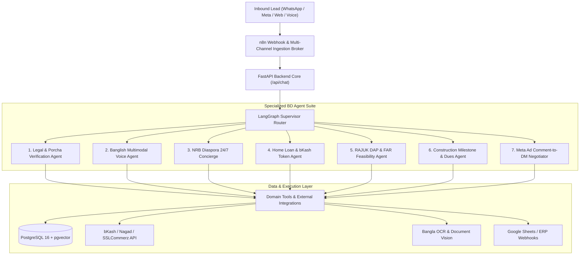
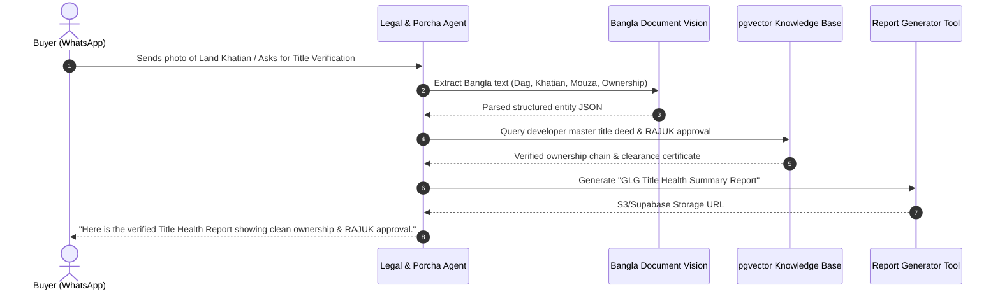
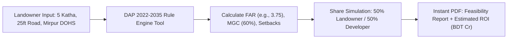

# Bangladesh Real Estate Agentic AI Feature Blueprint & Strategy

**Project**: GLG Assets Real Estate AI Engagement & Automation Platform  
**Target Market**: Bangladesh Real Estate Developers, Agencies & Asset Managers (Dhaka, Chittagong, Sylhet, Purbachal)  
**Date**: August 2026  
**Document Version**: 1.0  
**Status**: Approved Feature Blueprint  

---

## 1. Executive Summary & Market Context

In Bangladesh, real estate purchases represent high-value investments (BDT 1.5 Cr to 15+ Cr / $150k to $1.5M+) characterized by extended decision cycles (30 to 90 days), high risk sensitivity, complex documentation, and fragmented communication channels.

While traditional bots rely on rigid keyword trees or naive LLM completions, an **Agentic AI Architecture** introduces autonomous multi-agent reasoning, dynamic tool calling, multimodal voice/document understanding, and automated multi-system orchestration.



---

## 2. In-Depth Agentic AI Feature Specifications

---

### Feature 1: Autonomous Land & Legal Compliance Agent ("Dalil & Porcha Checker")

#### 🇧🇩 Market Pain Point
Disputed land ownership, fraudulent deeds, and unauthorized building constructions (non-compliance with RAJUK/CDA) are the single largest source of buyer hesitation in Bangladesh. Buyers frequently demand chain-of-title verification:
* **CS, SA, RS, and City Jarip / BS Porcha (Khatian)**.
* **Namjari / Mutation Porcha & DCR** (Duplicate Carbon Receipt).
* **RAJUK Approved Sheet & Plan** (FAR clearance, setback conformity).
* **Non-Encumbrance Certificate (NEC)** from Sub-Registry offices.

#### 🤖 Agentic Implementation Architecture
* **Vision & OCR Pipeline**: Evaluates smartphone photos or PDF scans of *Khatians*, *Dalils*, or mutation receipts uploaded via WhatsApp or Webchat.
* **Extraction Tool**: Extracts Dag No (দাগ নং), Khatian No (খতিয়ান নং), Mouza (মৌজা), J.L. No, and current ownership proportions.
* **Cross-Validation Graph Node**: Cross-references extracted parcel data with the developer's registered project deeds stored in `pgvector` knowledge collections.
* **Autonomous Output**: Generates an instant, downloadable, watermarked **"GLG Property Title Health Report" (PDF)** for the prospective buyer.



---

### Feature 2: Banglish Voice-Note & Multimodal WhatsApp Agent

#### 🇧🇩 Market Pain Point
In Bangladesh, high-net-worth buyers, non-tech-savvy investors, and traditional business owners (from Old Dhaka, Khatunganj, Chowkbazar) prefer sending **WhatsApp audio notes in colloquial Banglish** (*"Bhai, Gulshan 2 e 3 bed er flat ache? Budget 4 koti, south facing lagbe"*) rather than typing formal English.

#### 🤖 Agentic Implementation Architecture
* **Audio Ingestion**: Captures voice notes (`.ogg`/`.mp3`) via n8n WhatsApp Cloud API webhooks.
* **Transcription & Entity Normalization**: Uses OpenAI Whisper fine-tuned with a local Bangladeshi real estate lexicon (Katha, Bigha, Sft, South-Facing, Lake-View, Corner Plot, Piling, Handover).
* **Autonomous Reasoning**: Identifies spatial preferences, budget brackets in *Lakh* / *Crore* BDT, and project location entities.
* **Multimodal Response Delivery**:
  * Synthesizes an audio reply in a natural, polite Bangladeshi tone (Bangla/English).
  * Simultaneously delivers the matching unit card, pricing breakdown, and interactive floor plan.

---

### Feature 3: 24/7 NRB (Non-Resident Bangladeshi) Diaspora Concierge

#### 🇧🇩 Market Pain Point
Non-Resident Bangladeshis (NRBs in USA, UK, Canada, UAE, Saudi Arabia, Australia) generate **35–40% of luxury housing and land sales** in Dhaka, Purbachal, and Sylhet. They face:
* 6 to 12 hour timezone disconnects with local sales teams.
* Ambiguity surrounding **Bangladesh Bank foreign currency remittance incentives** (e.g., 2.5% cash incentive, foreign currency accounts).
* Complex **Power of Attorney (POA)** legal validation via Bangladesh High Commissions / Embassies abroad.

#### 🤖 Agentic Implementation Architecture
* **Currency & Investment Calculator Tool**: Live FX rate conversion (USD/GBP/AED $\to$ BDT) with automated tax exemption modeling for foreign remittance.
* **Embassy POA Verification Navigator**: Multi-turn guidance detailing document notarization, Ministry of Foreign Affairs (MOFA) attestation, and DC office validation steps.
* **Autonomous Virtual Tour & Appointment Scheduler**: Synchronizes with project sales leads' Google Calendar, offering instant Zoom / Google Meet bookings mapped to the expat's local timezone.

---

### Feature 4: Bank Home Loan (DBH / IPDC) & bKash/Nagad Token Booking Agent

#### 🇧🇩 Market Pain Point
* Over 60% of middle-to-luxury home buyers seek home loans through institutions like **DBH (Delta BRAC Housing), IPDC, BRAC Bank, City Bank, IDLC**, but drop out due to confusing Debt Burden Ratio (DBR) calculations and paperwork.
* Serious buyers often want to reserve an apartment unit immediately before upcoming price escalations.

#### 🤖 Agentic Implementation Architecture
* **Mortgage Underwriting & Pre-Qualification Tool**:
  * Collects customer monthly gross income, existing EMI burdens, and age.
  * Calculates DBR (Debt Burden Ratio) and computes maximum loan eligibility across partner banks.
  * Produces side-by-side comparative EMI tables for 10, 15, and 20-year tenures.
* **Autonomous Token Booking & Micro-Reservation**:
  * Integrates with **bKash Merchant / Nagad / SSLCommerz APIs**.
  * Generates a temporary 48-hour reservation payment link (e.g., BDT 50,000 to 200,000 booking token).
  * On successful callback, updates unit status to `RESERVED` in PostgreSQL, issues a digital Money Receipt (MR), and pushes an instant WhatsApp alert to the Sales Director.

---

### Feature 5: RAJUK DAP (Detailed Area Plan) & FAR Feasibility Agent

#### 🇧🇩 Market Pain Point
Joint Venture (JV) land development with private landowners is a primary expansion mechanism for Bangladeshi developers. Landowners consistently ask:
> *"I have a 6 Katha plot in Bashundhara Block-I with a 30ft road. Under DAP 2022–2035, how many floors can I build, what is my FAR, and what will be my apartment share?"*

#### 🤖 Agentic Implementation Architecture
* **DAP 2022–2035 Rule Engine**:
  * Computes **FAR (Floor Area Ratio)**, MGC (Maximum Ground Coverage), and road-width setback constraints.
  * Calculates total buildable gross square footage, net saleable area, and floor count.
* **Landowner Profit-Share Simulator**:
  * Computes landowner vs. developer ratio (e.g., 50-50, 45-55) based on local land price per katha vs. construction cost per sft.
  * Generates an executive **"Landowner Development Feasibility Brief"**, serving as a prime B2B lead generation magnet for land acquisition.



---

### Feature 6: Autonomous Construction Milestone & Dues Recovery Agent

#### 🇧🇩 Market Pain Point
Real estate in Bangladesh is sold off-plan across 36 to 48 month installment schedules tied to engineering milestones (*Piling complete, Roof casting 3rd floor, Brickwork, Plastering*). Manual collections create payment delays, customer friction, and strained relationships.

#### 🤖 Agentic Implementation Architecture
* **Milestone Event Trigger**: When site engineers update a project phase in the Developer Console, the agent triggers an automated workflow:
  1. Identifies all buyers tied to the active building phase.
  2. Synthesizes a personalized WhatsApp progress report containing **verified site photos and drone footage**.
  3. Attaches an automated **Statement of Account (SOA) & Next Milestone Invoice**.
  4. Provides instant direct bank transfer instructions (BEFTN/NPSB/RTGS) and digital payment gateway links.
  5. Schedules polite, non-intrusive reminder cadences.

---

### Feature 7: Meta Comment-to-WhatsApp Viral Bridge & Smart Negotiator

#### 🇧🇩 Market Pain Point
Meta ads (Facebook & Instagram) drive over 80% of real estate digital traffic in Bangladesh. Boosted posts generate thousands of generic comments (*"Price please", "Details pathan", "Per sft koto?"*). Generic auto-replies or slow manual responses suffer massive drop-offs.

#### 🤖 Agentic Implementation Architecture
* **Dual-Action Funnel**:
  * **Public Action**: Replies to the Facebook comment with high-engagement variations (*"ধন্যবাদ! বিস্তারিত তথ্য এবং ফ্লোর প্ল্যান আপনার ইনবক্সে পাঠানো হয়েছে। অনুগ্রহ করে চেক করুন।"*) to maximize Facebook algorithm reach.
  * **Private Action**: Simultaneously opens a Facebook Messenger / WhatsApp thread delivering exact pricing sheets, bedroom options, and interactive brochures within **3 seconds**.
* **Autonomous Micro-Negotiator**:
  * Recognizes budget mismatches (*"Budget 3.5 Cr e hobe?"* for a 4.0 Cr unit).
  * Automatically proposes alternative units, custom installment extensions, or parking concessions within pre-authorized developer thresholds.
  * High-intent leads trigger an instant notification to the Sales General Manager for one-click human takeover.

---

## 3. Comparative Architecture: Traditional Bot vs. Agentic Real Estate OS

| Capability | Traditional Chatbot (e.g., BotSailor, ManyChat) | GLG Assets Agentic Real Estate OS |
| :--- | :--- | :--- |
| **Document Processing** | Static FAQs / rigid text trees | **Multi-page PDF OCR (Khatian, Dalil, RAJUK approvals)** |
| **Dialect Understanding** | English or exact keyword matching | **Colloquial Bangla, phonetic Banglish, audio voice notes** |
| **Financial Computation** | Static text response | **Dynamic DBH/IPDC loan calculator & DBR analysis** |
| **Transaction Flow** | Directs to phone number | **bKash/Nagad token booking & dynamic Money Receipt generation** |
| **Regulatory Knowledge** | None | **RAJUK DAP 2022–2035 FAR & Landowner JV feasibility** |
| **Post-Sale Operations** | None | **Milestone-triggered photo updates & ledger payment recovery** |
| **Control & Guardrails** | Uncontrolled LLM or rigid rules | **LangGraph state machine with deterministic RAG + HITL** |

---

## 4. Implementation Roadmap & Prioritization Matrix

```
       HIGH IMPACT │ 
                   │  [Feature 1: Banglish Voice Agent]      [Feature 7: Meta Comment-to-DM Bridge]
                   │  [Feature 3: NRB Expat Concierge]        [Feature 4: Loan & bKash Token Agent]
                   │  [Feature 1: Legal & Porcha Checker]
                   │
                   │  [Feature 5: RAJUK DAP Feasibility]     [Feature 6: Milestone Dues Recovery]
        LOW IMPACT │
                   └─────────────────────────────────────────────────────────────
                     LOW COMPLEXITY                              HIGH COMPLEXITY
```

### Phased Sprint Schedule

* **Phase 1 (Immediate - Sprints 1 & 2)**:
  * Banglish WhatsApp Voice-Note Ingestion (Whisper + LangGraph).
  * Meta Comment-to-WhatsApp Funnel with dynamic project brochure delivery.
  * DBH / IPDC Home Loan EMI & Eligibility Calculator Tool.
* **Phase 2 (Expansion - Sprints 3 & 4)**:
  * NRB Diaspora 24/7 Expat Concierge (Currency converter, POA guide, Virtual tour booking).
  * bKash / Nagad / SSLCommerz Token Booking and Digital Money Receipt (MR) engine.
  * RAJUK DAP 2022–2035 FAR Feasibility Engine for Landowners.
* **Phase 3 (Enterprise Maturity - Sprints 5 & 6)**:
  * Bangla Legal Deed & Khatian OCR Transparency Analyzer.
  * Milestone-driven Construction Progress & Installment Recovery System.
  * Real-time Sales Executive Chauffeur / Uber API dispatch for on-site VIP visits.

---

## 5. Summary & Competitive Advantage

By deploying these Bangladesh-specific Agentic AI features, GLG Assets transitions from a communication tool to an **indispensable Real Estate Sales & Legal Operating System**. 

It directly solves the unique operational friction points of the Bangladesh market: **Title Trust, Banglish Audio Preferences, Diaspora Remittances, Bank Financing, and Developer Land Acquisition**.
