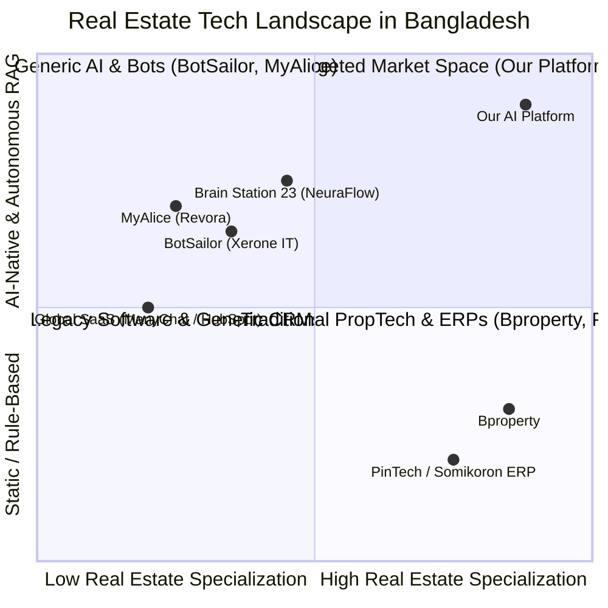

# Bangladesh Real Estate AI Automation & PropTech Competitor Analysis

**Project**: GLG Assets Real Estate AI Engagement & Automation Platform  
**Target Market**: Bangladesh Real Estate Developers, Agencies & Asset Managers (Dhaka, Chittagong, Sylhet)  
**Date**: August 2026  
**Document Version**: 1.0  

---

## 1. Executive Summary & Market Landscape

In Bangladesh, the real estate sector is undergoing rapid digital transition. However, existing software solutions in the market remain divided into three isolated buckets:
1. **Static Property Listing Portals** (e.g., *Bproperty, Bikroy, Property Platform BD*)
2. **Traditional Back-Office ERP & Accounting Systems** (e.g., *PinTech ERP, Somikoron IT, Focus REMS*)
3. **Generic E-commerce / Messaging Chatbot Tools** (e.g., *BotSailor / Xerone IT, MyAlice / Alice Labs, HelloSend*)

### Platform Market Fit & Niche
Our platform provides a **verticalized, AI-native Real Estate Engagement & RAG Operating System**. It connects front-line marketing (Meta Facebook/Instagram ad comments, WhatsApp, Messenger, and Webchat) directly with intelligent document-grounded RAG (pgvector/Pinecone), lead scoring, automated CRM pipeline handoffs, and human takeover tools.

---

## 2. In-Depth Competitor Breakdown by Category

### Category 1: PropTech Marketplaces & Portals

#### 1. Bproperty (Digital Classifieds Group / Rupayan Group)
* **Classification**: Full-Service PropTech Marketplace & Real Estate Brokerage
* **Core Offerings**: Property listings, 360-degree virtual tours, in-house legal advisory, mortgage facilitation.
* **Strengths**:
  * Strong brand authority and high organic traffic across Bangladesh.
  * Extensive verified property inventory in Dhaka and Chittagong.
  * Backed by institutional investments (DCG & Rupayan Group).
* **Gaps & Vulnerabilities vs. Our System**:
  * **Brand Conflict of Interest**: Bproperty operates as a multi-developer marketplace, meaning a customer inquiring about a specific developer's project can be cross-sold to competitors.
  * **Manual Call Center Workflow**: Inquiries are routed to manual call center reps, creating a 2–6 hour response lag during peak ad campaigns.
  * **High Commission Model**: High transactional fees rather than a fixed-cost developer software platform.

#### 2. Property Platform BD & Bikroy.com (Real Estate Division)
* **Classification**: Classified Property Advertising Platforms
* **Core Offerings**: DIY property listings for individual landlords, brokers, and developers.
* **Strengths**: High search volume, low-barrier ad posting.
* **Gaps & Vulnerabilities vs. Our System**:
  * Entirely passive listings with no conversational AI, instant qualification, or automatic document delivery.

---

### Category 2: Conversational AI & Social Automation Platforms (Local)

#### 1. BotSailor (Xerone IT)
* **Classification**: WhatsApp & Facebook Messenger Chatbot Builder
* **Target Audience**: SMEs, E-commerce vendors, Digital marketing agencies in Bangladesh.
* **Strengths**:
  * Affordable local pricing in BDT and USD.
  * Official WhatsApp Cloud API integration and broadcast messaging.
* **Gaps & Vulnerabilities vs. Our System**:
  * **Rule-Based Decision Trees**: Relies on static keyword triggers or basic OpenAI completion without vector RAG grounding.
  * **No Domain Document Understanding**: Cannot extract specific clauses from a 40-page PDF brochure, legal deed, or dynamic installment schedule.
  * **No Real Estate Role Hierarchy**: Lacks developer, agent, and executive management role segregation.

#### 2. MyAlice / Revora (Alice Labs)
* **Classification**: Omnichannel Social Commerce & Helpdesk Engine
* **Target Audience**: E-commerce stores, retail brands, multi-channel customer support teams.
* **Strengths**:
  * Unified social inbox (Facebook, Instagram, WhatsApp, Webchat).
  * Automated order tracking and cart recovery workflows.
* **Gaps & Vulnerabilities vs. Our System**:
  * **E-Commerce Bias**: Built for quick transactional checkouts rather than the 30–90 day consultative nurturing required for multi-crore real estate assets.
  * **No Spatial / Unit Matching**: Lacks property floor plan indexing, price-per-square-foot calculators, and spatial unit matching.

#### 3. Brain Station 23 (NeuraFlow Enterprise Conversational AI)
* **Classification**: Enterprise Custom AI & Software Engineering Consultancy
* **Target Audience**: Large banks, telecom providers, conglomerates.
* **Strengths**: Custom enterprise integrations, dedicated data engineering, robust enterprise security.
* **Gaps & Vulnerabilities vs. Our System**:
  * High upfront development cost ($20,000–$50,000+) and 3–6 month delivery cycles.
  * Not a turn-key, pre-trained real estate SaaS product.

---

### Category 3: Local Real Estate ERPs & Traditional CRMs

#### 1. PinTech ERP / PinCRM & Somikoron IT
* **Classification**: Back-Office Real Estate ERP & Billing Software
* **Target Audience**: Medium-to-large real estate developers in Dhaka (REHAB members).
* **Strengths**:
  * Deep local compliance for Bangladeshi real estate: milestone billing, deed registration logs, landowner share calculations.
  * Integrated inventory and construction material tracking.
* **Gaps & Vulnerabilities vs. Our System**:
  * **Legacy Architecture**: Rigid, desktop-first or clunky web UIs.
  * **Zero Front-End AI Automation**: Requires sales staff to manually log leads, send emails, and answer customer chats.
  * **No Automated Meta Ad Integration**: No automated bridge between Facebook ad comments and private Messenger/WhatsApp chats.

---

### Category 4: International SaaS Used by Top Developers (Shanta, bti, Concord)

#### 1. ManyChat / WATI / Kommo / HubSpot
* **Strengths**: Mature workflow builders, global reliability, sleek interfaces.
* **Gaps & Vulnerabilities vs. Our System**:
  * **Language Barrier**: Poor phonetic *Banglish* (*"Ami 3 bed er flat khujchi Gulshan e"*) and colloquial Bengali processing.
  * **Expensive USD Subscriptions**: Pricing scales aggressively with contact volume.
  * **Generic RAG**: Requires extensive custom third-party integrations to handle complex property catalogs.

---

## 3. Comprehensive Feature Comparison Matrix

| Capability / Dimension | **Our Real Estate AI Platform** | **Bproperty** | **BotSailor (Xerone)** | **MyAlice** | **PinTech ERP** | **International SaaS (ManyChat/HubSpot)** |
| :--- | :---: | :---: | :---: | :---: | :---: | :---: |
| **Real Estate RAG with PDF OCR & Vector Search** | ✅ **Native (pgvector + Pinecone)** | ❌ None | ❌ None | ❌ None | ❌ None | ⚠️ Requires 3rd-party custom setup |
| **Bangla / Banglish Phonetic NLP Understanding** | ✅ **Native Multilingual** | ❌ (Human agents only) | ⚠️ Keyword matching | ⚠️ Basic chat | ❌ None | ❌ English-biased |
| **Automated Meta Comment-to-DM Bridge** | ✅ **Built-in Agent** | ❌ None | ⚠️ Keyword template | ⚠️ Basic | ❌ None | ⚠️ Rule-based only |
| **Live Human Takeover & Sentiment Escalation** | ✅ **Integrated** | ❌ None | ⚠️ Basic | ✅ Yes | ❌ None | ✅ Yes |
| **Real Estate Financial & Payment Plan Simulator** | ✅ **Built-in** | ⚠️ Basic static tool | ❌ None | ❌ None | ⚠️ Manual table | ❌ None |
| **Multi-Role RBAC (Admin, Dev, Agent, Manager)** | ✅ **Enforced** | ❌ Portal user only | ⚠️ Single workspace | ⚠️ Agent only | ✅ Back-office | ⚠️ Generic seats |
| **Local BD Market Context (Katha, RAJUK, Bigha, Deeds)** | ✅ **Pre-Trained** | ✅ Human reps | ❌ None | ❌ None | ⚠️ Static form fields | ❌ None |
| **Deployability** | ⚡ **Turn-key SaaS / API** | ❌ Managed brokerage | ⚡ Turn-key generic | ⚡ Turn-key e-com | ⏳ 3-6 month ERP rollout | ⚡ Turn-key generic |

---

## 4. Strategic Competitive Moats

### 1. The Zero-Second "Comment-to-DM" Lead Conversion Moat
* In Bangladesh, property developers invest heavily in Meta ads (Facebook & Instagram). 
* Over 65% of potential high-net-worth buyers express interest by commenting on posts (*"Price please"*, *"Brochure pathan"*, *"Location kothay?"*).
* Traditional sales teams take 2–6 hours to respond, leading to drop-offs.
* **Our Moat**: Our automated bridge replies publicly to boost algorithmic reach, while simultaneously initiating a personalized private DM with the exact verified project brochure, pricing tier, and interactive unit selector within **3 seconds**.

### 2. Hallucination-Free RAG Document Grounding
* Real estate buyers in Dhaka demand exact figures regarding square footage, handover dates, booking percentages, and RAJUK approvals.
* Generic LLMs hallucinate numbers. Our hybrid RAG system (combining pgvector semantic search and keyword BM25 retrieval) pulls answers strictly from verified brochures, pricing schedules, and developer deeds.

### 3. Native Banglish & Dialect Processing
* High-net-worth local and expatriate Bangladeshi buyers frequently communicate in phonetic Romanized Bengali (*"Bhai, Down payment koto lagbe ar EMI option ache ki?"*).
* Our custom prompt architecture processes English, formal Bengali, and phonetic Banglish interchangeably without breaking context.

### 4. 100% Data Sovereignty for Developers
* Unlike Bproperty where customer data and leads are owned by the marketplace, our system gives each developer a private, sandboxed deployment where customer lists and pricing policies remain strictly confidential.

---

## 5. Actionable Go-To-Market (GTM) Recommendations

1. **Direct B2B Developer Partnerships**:
   * Target leading mid-to-luxury developers in Dhaka (e.g., Gulshan, Banani, Dhanmondi, Bashundhara, Uttara projects) with a clear value proposition: *"Convert 3x more Facebook ad comments into qualified site-visit appointments."*
2. **Co-Existence with Legacy ERPs**:
   * Position our platform not as an ERP replacement, but as the **AI-powered front-end sales engine** that captures and qualifies leads before pushing them into back-office tools like PinTech or Salesforce via webhooks.
3. **Expatriate Buyer Focus (NRB Segment)**:
   * Non-Resident Bangladeshis (NRBs) in the US, UK, Middle East, and Canada look to buy property in Dhaka but struggle with time-zone delays. Emphasize our **24/7 instant WhatsApp concierge** to capture high-value diaspora investments.
