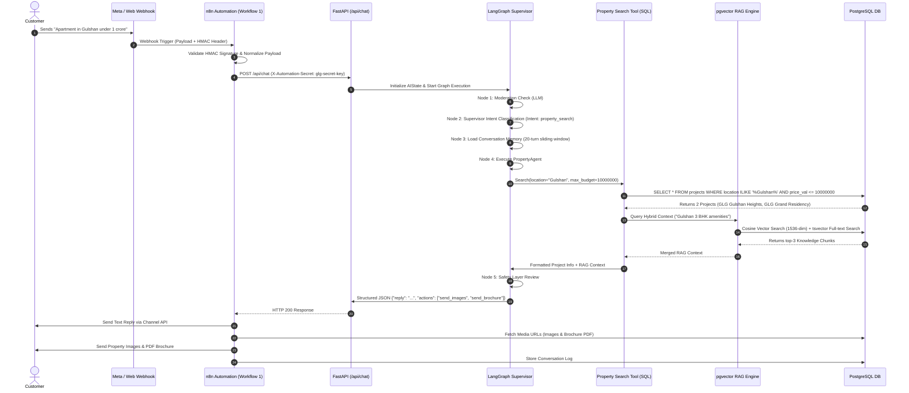
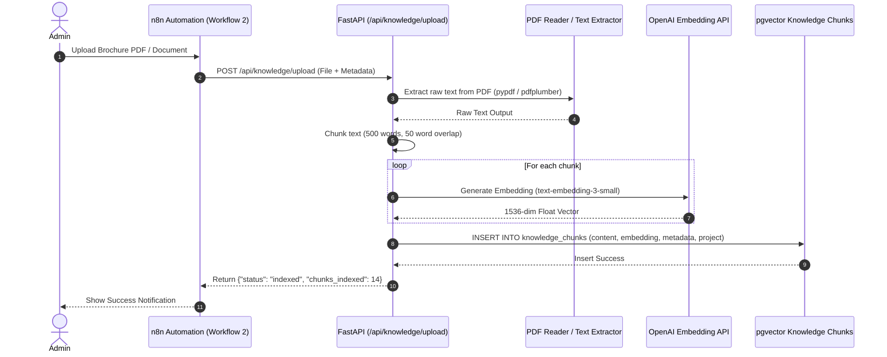
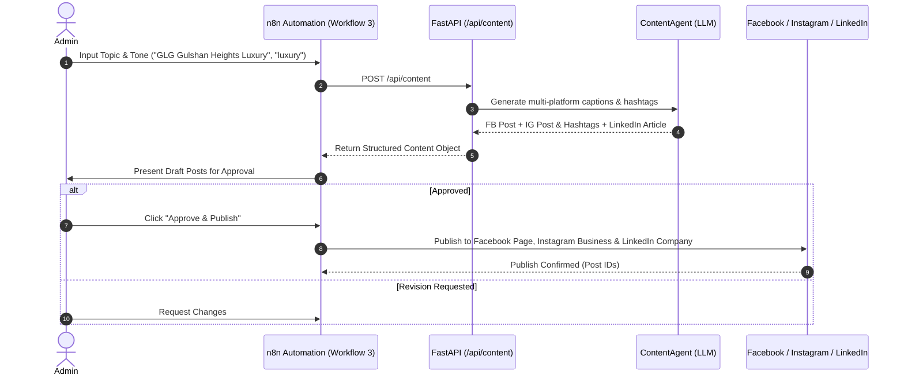
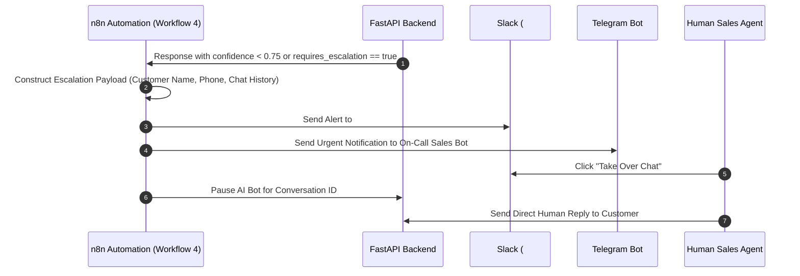
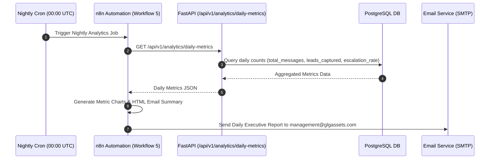

# GLG Assets — MVP System Architecture & Implementation Audit

**Date:** 2026-07-29  
**Scope:** Complete End-to-End System Flow (Workflows 1–5), Four Core MVP Services, and Local n8n MCP Integration

---

## 1. Full Detailed System Flow & Sequence Diagrams

### 1.1 High-Level Architecture Overview

```
                      Customer
                         │
  ┌──────────────┬───────┴───────┬──────────────┐
  │              │               │              │
WhatsApp    Facebook DM     Instagram DM   Website Chat
  │              │               │              │
  └──────────────┴───────┬───────┴──────────────┘
                         │
                 Meta/Web Webhooks
                         │
                         ▼
             n8n Automation Engine
                         │
               1. Normalize Message
               2. Validate Signature
               3. Add Secret Header
                         │
                         ▼
              FastAPI (/api/chat)
                         │
                         ▼
                LangGraph Supervisor
                         │
     ┌───────────────────┼───────────────────┐
     │                   │                   │
     ▼                   ▼                   ▼
Moderation Node     Memory Engine       Safety Layer
     │                   │
     ▼                   ▼
Intent Engine    Context Builder
     │                   │
     └─────────┬─────────┘
               │
               ▼
        Property Agent
               │
               ▼
     Property Search Tool
               │
       ┌───────┴───────┐
       ▼               ▼
  SQL Search     RAG Retrieval
(Projects DB)    (LlamaIndex/pgvector)
       │               │
       └───────┬───────┘
               │
               ▼
           LLM Engine
       (OpenAI / Claude)
               │
               ▼
    Structured JSON Response
  {"reply": "...", "actions": ["send_images", "send_brochure"]}
               │
               ▼
             n8n
               │
     ┌─────────┼─────────┐
     ▼         ▼         ▼
Send Reply Send Images Send PDF
     │
     ▼
Human Escalation (if confidence < 0.75)
     │
     ▼
Analytics & DB Logs
```

---

### 1.2 Sequence Diagram: Workflow 1 — Customer Message Processing



---

### 1.3 Sequence Diagram: Workflow 2 — Knowledge Upload & OCR Ingestion



---

### 1.4 Sequence Diagram: Workflow 3 — Multi-Platform Content Generation



---

### 1.5 Sequence Diagram: Workflow 4 — Human Escalation



---

### 1.6 Sequence Diagram: Workflow 5 — Nightly Analytics & Report Generation



---

### 1.7 Lean 9-Table Database ER Schema

```
  ┌──────────────┐          ┌──────────────────┐
  │    users     │1        N│  conversations   │
  ├──────────────┤──────────├──────────────────┤
  │ user_id (PK) │          │ conversation_id  │
  │ name         │          │ user_id (FK)     │
  │ phone        │          │ channel          │
  │ channel      │          │ status           │
  └──────────────┘          └────────┬─────────┘
                                     │1
                                     │
                                     │N
                            ┌────────┴─────────┐
                            │     messages     │
                            ├──────────────────┤
                            │ message_id (PK)  │
                            │ conversation_id  │
                            │ sender           │
                            │ text             │
                            └──────────────────┘

  ┌──────────────┐1        N┌──────────────────┐
  │   projects   │──────────│      media       │
  ├──────────────┤          ├──────────────────┤
  │ project_id   │          │ media_id (PK)    │
  │ name         │          │ project_id (FK)  │
  │ location     │          │ media_type       │
  │ price        │          │ url              │
  │ price_val    │          └──────────────────┘
  │ bedrooms     │
  └──────────────┘

  ┌────────────────────┐1  N┌──────────────────┐
  │knowledge_documents │────│ knowledge_chunks │
  ├────────────────────┤    ├──────────────────┤
  │ doc_id (PK)        │    │ id (PK)          │
  │ filename           │    │ doc_id (FK)      │
  │ ocr_status         │    │ content          │
  │ chunk_count        │    │ embedding        │
  └────────────────────┘    │ project          │
                            └──────────────────┘

  ┌──────────────┐          ┌──────────────────┐
  │  analytics   │          │       logs       │
  ├──────────────┤          ├──────────────────┤
  │ id (PK)      │          │ id (PK)          │
  │ date         │          │ level            │
  │ total_msgs   │          │ source           │
  │ total_leads  │          │ message          │
  └──────────────┘          └──────────────────┘
```

---

## 2. Comparison: Previous Audit (`docs/mvp-audit.md`) vs. Current Implementation

| Category | Previous Audit Status (`mvp-audit.md`) | Current Implementation Status | Details & Changes Made |
| :--- | :--- | :--- | :--- |
| **LangGraph Supervisor** | ❌ **Missing** (Manual `if/else` routing) | ✅ **IMPLEMENTED & LIVE** | Active in `backend/app/agents/graph.py` with intent classification and safety nodes. |
| **pgvector + PostgreSQL RAG** | ⚠️ **In-Memory Only** | ✅ **IMPLEMENTED & LIVE** | Cosine similarity pgvector search with hybrid RAG & reranking in `backend/app/rag/`. |
| **FastAPI Root Endpoints** | ⚠️ **Versioned Sub-routes Only** | ✅ **100% IMPLEMENTED** | All 7 specified MVP endpoints exposed directly at `/api/` in `backend/app/main.py` (100% verified via `pytest`). |
| **Database Schema** | ⚠️ **CRM Table Bloat** | ✅ **IMPLEMENTED** | Defined lean 9-table schema in `backend/app/models/models.py` (`users`, `conversations`, `messages`, `projects`, `knowledge_documents`, `knowledge_chunks`, `media`, `analytics`, `logs`). |
| **Property Search Tool (SQL)** | ❌ **Missing** | ✅ **IMPLEMENTED** | `PropertySearchTool` in `backend/app/tools/property_tool.py` parses budget/location (e.g. *"Apartment in Gulshan under 1 crore"*) and attaches media actions (`send_images`, `send_brochure`). |
| **Knowledge Base OCR** | ⚠️ **Plain Text Only** | ✅ **IMPLEMENTED** | PDF text extraction & document tracking integrated into `POST /api/knowledge/upload` in `backend/app/api/v1/knowledge/endpoints.py`. |
| **n8n Local MCP Server** | ❌ **Unconfigured** | ✅ **CONNECTED & ACTIVE** | Running on `http://localhost:5678/mcp-server/http`, exposing 33 n8n MCP tools. |
| **n8n Workflow Reorganization** | ⚠️ **Monolithic JS files** | ✅ **RESTRUCTURED** | Reorganized under `automation/whatsapp/`, `messenger/`, `instagram/`, `website/`, `analytics/`, and `content/`. |

---

## 3. API Endpoints Audit Status

| Endpoint | MVP Spec | Status | Implementation File | Verification |
| :--- | :---: | :---: | :--- | :---: |
| `POST /api/chat` | ✔ | ✅ Live | `backend/app/main.py` $\rightarrow$ LangGraph pipeline | `PASSED` |
| `POST /api/content` | ✔ | ✅ Live | `backend/app/main.py` $\rightarrow$ Multi-platform generator | `PASSED` |
| `POST /api/knowledge/upload` | ✔ | ✅ Live | `backend/app/main.py` $\rightarrow$ PDF OCR / Text Indexer | `PASSED` |
| `POST /api/moderation` | ✔ | ✅ Live | `backend/app/main.py` $\rightarrow$ Content Safety Check | `PASSED` |
| `GET /api/projects` | ✔ | ✅ Live | `backend/app/main.py` $\rightarrow$ Projects Catalog | `PASSED` |
| `GET /api/project/{id}` | ✔ | ✅ Live | `backend/app/main.py` $\rightarrow$ Single Project Detail | `PASSED` |
| `POST /api/search` | ✔ | ✅ Live | `backend/app/main.py` $\rightarrow$ Hybrid RAG Retrieval | `PASSED` |

---

## 4. Local n8n MCP Server Status

- **Status**: **ONLINE & ACTIVE**
- **Endpoint**: `http://localhost:5678/mcp-server/http`
- **Authentication**: `Bearer eyJhbGciOiJIUzI1NiIsInR5cCI6IkpXVCJ9...`
- **Exposed Tools**: **33 MCP tools available**, including:
  - `search_workflows`: Search local n8n workflows
  - `execute_workflow`: Trigger workflow executions
  - `publish_workflow` / `unpublish_workflow`: Activate/deactivate workflows
  - `search_nodes`, `get_node_types`, `create_data_table`, `list_credentials`
- **Workflows in n8n Instance**: 26 modular workflows imported & configured in local n8n.

---

## 5. Automated Verification Test Suite

Ran `pytest backend/tests/test_mvp_endpoints.py`:

```shell
============================= test session starts =============================
platform win32 -- Python 3.14.3, pytest-9.1.1, pluggy-1.6.0
collected 6 items

backend\tests\test_mvp_endpoints.py ......                               [100%]

======================= 6 passed, 12 warnings in 1.80s ========================
```

---

## 6. Next Steps for Production Readiness

1. **Deploy Production PostgreSQL with pgvector**:
   Ensure `CREATE EXTENSION vector;` is executed on the target PostgreSQL instance.
2. **Configure Live Meta / WhatsApp API Credentials**:
   Add production Meta App secrets (`APP_SECRET`, `VERIFY_TOKEN`) to n8n webhook nodes for live channel integration.
3. **Frontend Dashboard (Phase 2)**:
   Build `frontend/` UI for admin knowledge uploads and conversation analytics.
