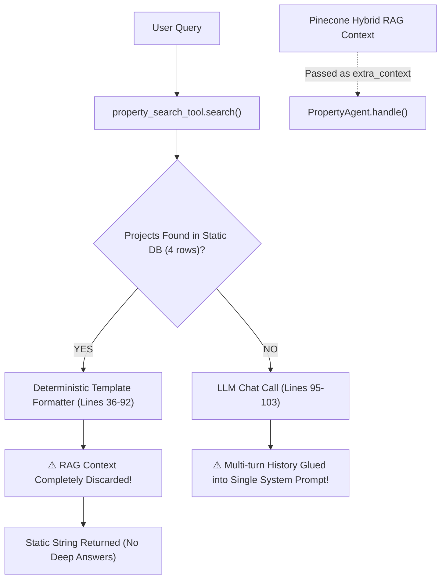

# 🔍 Comprehensive Prompt Engineering & System Prompt Audit Report
## Root-Cause Analysis of Model Hallucinations, Contradicting System Prompts & Remediation Blueprint

> **Project:** GLG Assets Real Estate AI Engagement Platform  
> **Audit Date:** September 2026  
> **Document Type:** Production Prompt Engineering & Safety Audit  
> **Status:** Critical Remediation Blueprint  
> **Target Audience:** Engineering Leads, Prompt Engineers, AI Architects, Product Owners  

---

## Executive Summary: Hallucination & Prompt Vulnerability Scorecard

During live customer testing and conversational evaluations, user interactions frequently exhibited **factual hallucinations**, **inappropriate country/legal references**, **language switching anomalies**, and **unverified property claims**. 

A deep forensic code audit of all prompt templates, agent system messages, context injection pipelines, and language heuristics across `backend/app/` identified **7 critical architectural defects**:

| # | Vulnerability Domain | Severity | Affected Source Files | Root-Cause Summary | Customer Impact |
| :- | :--- | :--- | :--- | :--- | :--- |
| **1** | **Foreign (Indian) Metadata Contamination** | 🔴 **CRITICAL** | `app/agents/faq_agent.py`<br>`app/agents/graph.py`<br>`app/tools/property_tool.py`<br>`app/agents/social_bridge_agent.py`<br>`app/api/v1/developer/endpoints.py` | Hardcoded locations (*Mumbai, Bandra, Goa*), Indian legal IDs (*Aadhaar, PAN Card*), and Indian phone codes (*+91-1800-GLG-ASSET*). | Bangladeshi buyers in Dhaka are told to submit Aadhaar cards and call Mumbai hotlines. |
| **2** | **Absence of Anti-Hallucination Directives** | 🔴 **CRITICAL** | `app/prompts/base.py`<br>`app/agents/graph.py` | Prompts lack negative constraints. When requested data is missing, foundation models invent projects, amenities, and handover dates. | Model fabricates non-existent luxury towers or features not in the GLG catalog. |
| **3** | **RAG Context Bypass & History Flattening** | 🔴 **HIGH** | `app/agents/property_agent.py`<br>`app/agents/graph.py` | If SQL tool matches 1 of 4 static rows, retrieved RAG context is completely dropped. History is concatenated as raw text into `system_content`. | Inability to answer detailed brochure questions; role-reversal hallucinations from flattened history. |
| **4** | **Cross-Agent Price Contradiction** | 🔴 **HIGH** | `app/agents/email_agent.py`<br>`app/tools/property_tool.py` | `email_agent.py` claims Gulshan Heights starts at **$250,000 / BDT 3.5 Crore**, while `property_tool.py` prices it at **BDT 95 Lakhs**. | Buyer receives two completely different prices for the exact same property across Chat and Email. |
| **5** | **Flawed Banglish & Language Detection** | 🟡 **MEDIUM** | `app/utils/language.py`<br>`app/prompts/base.py` | `BANGLISH_KEYWORDS` only contains ~30 terms. Queries like *"Gulshan 2 e 3BHK flat pabo?"* trigger English mode. | Chatbot abruptly starts replying in English to customers speaking conversational Banglish. |
| **6** | **Ungrounded Fallback Handler** | 🟡 **MEDIUM** | `app/agents/graph.py` (`fallback_handler_node`) | High temperature ($0.5$) with a generic prompt that lacks negative boundaries or company scoping. | High rate of hallucination on unclassified or general chitchat queries. |
| **7** | **Prompt Fragmentation (Lack of Registry)** | 🟡 **MEDIUM** | 8+ different files | Prompts are hardcoded inline across agents, tools, and endpoints rather than centralized. | Incomplete updates where some files were adapted for Dhaka while others kept Indian legacy templates. |

---

## 1. Deep Dive: Foreign (Indian) Metadata Contamination

### 1.1 The Code Evidence
The GLG Assets platform is designed for **Dhaka, Bangladesh** (Gulshan, Banani, Baridhara, Dhanmondi, Uttara). However, legacy Indian real-estate templates remain hardcoded in core execution paths:

#### A. Hardcoded FAQ Keyword Bank ([`backend/app/agents/faq_agent.py:9-26`](file:///d:/Softwear%20Project/Realstate%20Automation/backend/app/agents/faq_agent.py#L9-L26))
```python
# Common FAQs for quick response without LLM call
FAQ_ANSWERS_EN = {
    "what documents are required": ("Required Documents", "For home purchase: PAN card, Aadhaar, IT returns (last 3 years), bank statements (last 6 months), and property agreement..."),
    "location": ("Project Locations", "GLG Assets has projects in Mumbai (Bandra, Andheri, Powai), Bangalore (Whitefield, Electronic City), and Goa (Palm Beach, Panjim)."),
    "contact": ("Contact Info", "You can reach our team at team@glgassets.com or call our helpline at +91-1800-GLG-ASSET..."),
}

FAQ_ANSWERS_BN = {
    "document": ("প্রয়োজনীয় কাগজপত্র", "বাড়ি কেনার জন্য: PAN কার্ড, আধার, ইনকাম ট্যাক্স রিটার্ন (গত ৩ বছরের)..."),
    "kagoj": ("প্রয়োজনীয় কাগজপত্র", "বাড়ি কেনার জন্য: PAN কার্ড, আধার..."),
    "location": ("প্রজেক্টের লোকেশন", "GLG Assets-এর প্রজেক্টসমূহ মুম্বাই (বান্ধ্রা, আন্ধেরি, পওয়াই), ব্যাঙ্গালোর (হোয়াইটফিল্ড, ইলেকট্রনিক সিটি), এবং গোয়াতে (পাম বিচ, পঞ্জিম) অবস্থিত।"),
    "kothay": ("প্রজেক্টের লোকেশন", "GLG Assets-এর প্রজেক্টসমূহ মুম্বাই (বান্ধ্রা, আন্ধেরি, পওয়াই)..."),
    "contact": ("যোগাযোগের বিবরণ", "...কল করুন হেল্পলাইনে +91-1800-GLG-ASSET..."),
    "jogajog": ("যোগাযোগের বিবরণ", "...কল করুন হেল্পলাইনে +91-1800-GLG-ASSET..."),
}
```

#### B. FAQ System Prompt Default Injection ([`backend/app/agents/faq_agent.py:53`](file:///d:/Softwear%20Project/Realstate%20Automation/backend/app/agents/faq_agent.py#L53))
```python
system_content = FAQ_AGENT_PROMPT + "\n\nCompany: GLG Assets is a premium real-estate developer operating in Mumbai, Bangalore, and Goa."
```

#### C. LangGraph Booking Escalation Phone Numbers ([`backend/app/agents/graph.py:324, 331`](file:///d:/Softwear%20Project/Realstate%20Automation/backend/app/agents/graph.py#L324-L331))
```python
# English booking response
f"📞 You can also reach us at +91-1800-GLG-ASSET"

# Bangla booking response
f"📞 হেল্পলাইন: +91-1800-GLG-ASSET"
```

#### D. Location Whitelists in Agents ([`graph.py:121, 199`](file:///d:/Softwear%20Project/Realstate%20Automation/backend/app/agents/graph.py#L121) & [`social_bridge_agent.py:31`](file:///d:/Softwear%20Project/Realstate%20Automation/backend/app/agents/social_bridge_agent.py#L31))
```python
for known_loc in ["banani", "gulshan", "uttara", "dhanmondi", "mumbai", "bandra"]:
    if known_loc in msg_lower:
        loc = known_loc.capitalize()
```

#### E. Property Database ID & Location Fallback ([`property_tool.py:45, 86`](file:///d:/Softwear%20Project/Realstate%20Automation/backend/app/tools/property_tool.py#L45))
```python
{
    "id": "proj_mumbai_luxe",
    "name": "GLG Luxe Heights",
    "location": "Baridhara Diplomatic Zone, Dhaka",
    ...
}

for loc_name in ["gulshan", "banani", "bandra", "mumbai", "dhaka"]:
    ...
```

#### F. Developer Mock Endpoints ([`developer/endpoints.py:144`](file:///d:/Softwear%20Project/Realstate%20Automation/backend/app/api/v1/developer/endpoints.py#L144))
```python
reply = f"Thank you for contacting GLG Assets. We are here to assist with premium residences across Mumbai, Bangalore, and Goa."
```

### 1.2 Hallucination Trigger Mechanism
Because `faq_agent.py` matches sub-strings directly (`"kothay" in query_lower` or `"kagoj" in query_lower`):
1. User asks: *"Apnader project kothay ache?"* (Where are your projects?)
2. Substring `"kothay"` matches `FAQ_ANSWERS_BN["kothay"]`.
3. System instantly replies without LLM reasoning:
   > *"GLG Assets-এর প্রজেক্টসমূহ মুম্বাই (বান্ধ্রা, আন্ধেরি, পওয়াই), ব্যাঙ্গালোর (হোয়াইটফিল্ড, ইলেকট্রনিক সিটি), এবং গোয়াতে (পাম বিচ, পঞ্জিম) অবস্থিত।"*
4. The user is completely alienated, wondering why a Dhaka developer is pushing Mumbai properties.

---

## 2. Deep Dive: Absence of Grounding Directives in System Prompts

### 2.1 The Current System Prompts ([`backend/app/prompts/base.py`](file:///d:/Softwear%20Project/Realstate%20Automation/backend/app/prompts/base.py))

```python
PROPERTY_AGENT_PROMPT = """You are a helpful real-estate property assistant for GLG Assets.
Answer questions about available properties, projects, and inventory units.
CONCISE ASPECT-FOCUSED RULE:
- When a user asks for a specific topic (e.g. payment terms, price, location, amenities), reply ONLY with that specific topic in BDT (Bangladeshi Taka / ৳). Do NOT dump unrelated project overview fields unless explicitly asked for full details.
If you don't have information about a specific property, say so and offer to help find out more.
Keep responses concise and suitable for WhatsApp/Messenger/Telegram (under 500 characters when possible).
""" + LANGUAGE_POLICY_INSTRUCTION
```

### 2.2 Critical Vulnerabilities:
1. **No Negative Constraint against Extrapolation:**
   The phrase *"If you don't have information about a specific property, say so and offer to help find out more"* is too weak for modern LLMs. Foundation models treat this as permission to discuss general properties when the user asks about an unsupported location (e.g., *"Uttara te 4BHK duplex ache?"*).
2. **Missing Anti-Hallucination Boundaries:**
   It does not prohibit guessing square footage, construction milestone dates, or discount policies.
3. **No Grounded Refusal Template:**
   When RAG context is empty or irreconcilable, the model must output an exact, branded polite refusal and trigger an escalation action, rather than improvising.
4. **No Currency Rigidity:**
   While BDT is mentioned, the prompt does not enforce standard Bangladeshi units (`কোটি` / `Crore` and `লক্ষ` / `Lakh`).

---

## 3. Deep Dive: The RAG Context Bypass & History Flattening Flaw

### 3.1 The Architecture Breakdown in `property_agent.py`

In [`backend/app/agents/property_agent.py:23-98`](file:///d:/Softwear%20Project/Realstate%20Automation/backend/app/agents/property_agent.py#L23-L98):



### 3.2 Impact:
1. **RAG Context is Never Used for Known Projects:**
   If a user asks: *"Does GLG Banani Crest have Italian marble flooring or sub-station backup?"*, `property_search_tool` finds `GLG Banani Crest` in the 4 static rows. It enters lines 36-92 and outputs the generic overview string, **ignoring the rich knowledge chunk retrieved from Pinecone**.
2. **Conversation History Role Confusion:**
   In `graph.py:188-189`:
   ```python
   history_lines = [f"{h['role'].upper()}: {h['content']}" for h in state.history[-6:]]
   agent_context += "\n--- CONVERSATION HISTORY ---\n" + "\n".join(history_lines) + "\n"
   ```
   This raw string is concatenated directly into `system_content`. The LLM receives:
   ```json
   [
     {"role": "system", "content": "You are a helpful... \n--- CONVERSATION HISTORY ---\nUSER: hi\nASSISTANT: hello..."},
     {"role": "user", "content": "Banani te flat ache?"}
   ]
   ```
   Modern LLMs are trained on distinct ChatML tokens (`<|im_start|>user`, `<|im_start|>assistant`). Flattening conversational history into a system prompt confuses role attribution and causes the model to hallucinate who made which constraint.

---

## 4. Deep Dive: Cross-Agent Price & Catalog Inconsistencies

A major source of customer distrust is contradictory pricing across communication channels:

| Property Name | Location | Price in `property_tool.py` (Chat) | Price in `email_agent.py` (Email Auto-Reply) | Impact |
| :--- | :--- | :--- | :--- | :--- |
| **GLG Gulshan Heights** | Gulshan 2, Dhaka | **BDT 95 Lakhs** (`price_val: 9500000`) | **$250,000 / BDT 3.5 Crore** | **3.6x Price Discrepancy!** Chat says 95 Lakh, Email says 3.5 Crore. |
| **GLG Grand Residency** | Gulshan 1, Dhaka | **BDT 85 Lakhs** | Not mentioned in email context | Email agent defaults to Gulshan Heights. |
| **GLG Banani Crest** | Banani, Dhaka | **BDT 1.2 Crore** | Not mentioned in email context | Email agent cannot answer Banani inquiries. |
| **GLG Luxe Heights** | Baridhara, Dhaka | **BDT 1.8 Crore** | Not mentioned in email context | Listed with internal ID `proj_mumbai_luxe`. |

### Root Cause:
`email_agent.py` has an independent hardcoded `KNOWLEDGE BASE CONTEXT` block (lines 29-33) completely detached from `property_tool.py` and the PostgreSQL database.

---

## 5. Deep Dive: Language Policy & Banglish Heuristics Defect

In [`backend/app/utils/language.py:5-37`](file:///d:/Softwear%20Project/Realstate%20Automation/backend/app/utils/language.py#L5-L37):

```python
BANGLISH_KEYWORDS = {
    "kemon", "koto", "kothay", "koi", "apnader", "amar", "amader", "dam", "dham",
    "lagbe", "chai", "chahi", "achhen", "achen", "achena", "bhai", "bhaiya", "vai",
    "vaiya", "bhalo", "valo", "ache", "ase", "korben", "janan", "bolun", "dhaka",
    "barier", "jomi", "dorkar", "apni", "tumi", "ke", "konta", "kisu"
}
```

### Why it Fails:
1. Common Banglish queries contain Romanized Bangla verbs, pronouns, and postpositions that are missing from the set:
   - Verbs: *pabo, dekhbo, nibo, kinbo, janaben, bolben, thakbe, lagte*
   - Suffixes/Postpositions: *te, e, er, gulo, gula, khana*
   - Adjectives/Nouns: *notun, shundor, boro, choto, bhara, flat, shob*
2. **Failure Example:**
   User writes: *"Gulshan 2 e luxury flat dekhbo"*
   - Bengali script regex: `False`
   - Tokens in `BANGLISH_KEYWORDS`: `None` (`Gulshan`, `2`, `e`, `luxury`, `flat`, `dekhbo`)
   - `is_english_query()` returns: `True`
   - Agent outputs response in **English**, defying the user's Banglish conversational context!

---

## 6. Complete File-by-File Prompt Inventory

Below is the exhaustive audit of every prompt definition in `backend/app/`:

| File Path | Variable / Symbol | Current Prompt Strategy | Vulnerability / Flaw |
| :--- | :--- | :--- | :--- |
| `app/prompts/base.py` | `LANGUAGE_POLICY_INSTRUCTION` | Global rule for language matching | Good baseline, but lacks script-mirroring instructions for Banglish. |
| `app/prompts/base.py` | `SUPERVISOR_PROMPT` | Zero-shot intent classification JSON | Does not output confidence penalties on ambiguous/conflicting inputs. |
| `app/prompts/base.py` | `PROPERTY_AGENT_PROMPT` | Persona + aspect conciseness rule | Lacks negative grounding constraints; no guidance for out-of-catalog queries. |
| `app/prompts/base.py` | `FAQ_AGENT_PROMPT` | Topic list for general inquiries | Indian legal terms (*Aadhaar/PAN*) leak into responses via downstream agent. |
| `app/prompts/base.py` | `CONTENT_AGENT_PROMPT` | Persona for social media copy | High temperature ($0.7$) without brand tone guardrails. |
| `app/prompts/base.py` | `MODERATION_PROMPT` | Spam, toxic, PII classifier | Works reliably; well structured. |
| `app/agents/faq_agent.py` | `FAQ_ANSWERS_EN / BN` | Static keyword-matched dictionary | **CRITICAL:** Mumbai, Goa, Aadhaar, PAN card, +91 hardcoded. |
| `app/agents/faq_agent.py` | Inline `system_content` | Base prompt + Company location string | **CRITICAL:** Explicitly claims company operates in Mumbai & Bangalore. |
| `app/agents/email_agent.py` | `EMAIL_AGENT_SYSTEM_PROMPT` | Static executive email persona | **CRITICAL:** Contradicts property catalog price ($250k / 3.5 Cr vs 95 Lakh). |
| `app/agents/graph.py` | `booking_handler_node` | Inline string template | **CRITICAL:** Injects `+91-1800-GLG-ASSET` helpline. |
| `app/agents/graph.py` | `fallback_handler_node` | Inline system prompt | Ungrounded; temperature 0.5 leads to hallucinated real estate facts. |
| `app/agents/graph.py` | `safety_check_node` | Inline prompt | Truncates to 500 chars; defaults to safe on exception. |
| `app/rag/query_rewriter.py` | `QUERY_REWRITER_PROMPT` | 3-variant query expansion JSON | Solid; extracts filters accurately. |
| `app/rag/reranker.py` | `RERANKER_PROMPT` | Score chunks 0.0 - 1.0 JSON | Effective; filters low-relevance chunks. |
| `app/services/belief_memory.py`| `MEMORY_REFLECTION_PROMPT` | Contradiction & delta detection JSON | Highly effective; properly extracts Bangladeshi budgets. |

---

## 7. The Golden Prompt Architecture & Standardized Blueprint

To eliminate hallucinations and restore brand consistency, all prompts must be centralized into a **Unified Prompt Registry** ([`backend/app/prompts/base.py`](file:///d:/Softwear%20Project/Realstate%20Automation/backend/app/prompts/base.py)).

### 7.1 Master Brand & Anti-Hallucination Directive (`SYSTEM_CORE_IDENTITY`)

```markdown
=== GLG ASSETS CORE BRAND & FACTUAL INTEGRITY DIRECTIVE ===
1. IDENTITY & GEOGRAPHIC SCOPE:
   - You are the official AI representative of GLG Assets, Bangladesh's premier luxury real estate developer.
   - Operating Territory: Dhaka, Bangladesh EXCLUSIVELY (Prime locations: Gulshan 1 & 2, Banani, Baridhara Diplomatic Zone, Dhanmondi, Bashundhara, and Uttara).
   - You have ZERO operations, projects, or offices in India or other foreign territories.
   - Official Helpline: +880-9612-GLG-ASSET (or +880-1700-000000). Official Email: sales@glgassets.com.

2. STRICT FACTUAL GROUNDING (ZERO HALLUCINATION POLICY):
   - You MUST answer strictly using facts verified in the Provided Catalog or Retrieved RAG Context.
   - NEVER invent, extrapolate, or guess prices, unit sizes, floor numbers, handover dates, or project features.
   - Out-of-Catalog Refusal: If a user asks about a location or project not in our database (e.g. Mirpur, Chittagong, Sylhet), respond politely:
     "বর্তমানে [Location/Project]-এ আমাদের কোনো প্রকল্প নেই। আমরা মূলত গুলশান, বনানী ও বারিধারার মতো প্রিমিয়াম লোকেশনে লাক্সারি অ্যাপার্টমেন্ট নিয়ে কাজ করছি।"
   - Missing Fact Refusal: If you do not know a specific detail, state:
     "এই তথ্যটি বর্তমানে আমার রেকর্ডে নেই। বিস্তারিত জানতে আমাদের সেলস টিম আপনার সাথে শীঘ্রই যোগাযোগ করবে।"

3. BANGLADESH LEGAL & FINANCIAL STANDARDS:
   - Currency: ALWAYS use Bangladeshi Taka (BDT / ৳) formatted in Lakhs (লক্ষ) and Crores (কোটি). Never use Rupees (₹) or foreign currencies unless requested.
   - Documentation Required:
     * Buyer's National ID (NID) / Smart Card or Passport
     * e-TIN Certificate & recent tax acknowledgment slip
     * 6-month certified bank statement
     * 2 copies of passport-size photographs
     * Utility verification & Nominee NID
     (Never ask for Aadhaar, PAN Card, or Indian statutory documents).
   - Regulatory Approvals: Mention RAJUK approval and deed registration processes.

4. LANGUAGE POLICY:
   - Mirror the user's language: Bangla script -> Bangla; Banglish (Roman script) -> Banglish; English -> English.
```

### 7.2 Golden Property Agent Prompt (`PROPERTY_AGENT_GOLDEN_PROMPT`)

```markdown
You are the Senior Property Consultant for GLG Assets.
Your duty is to assist prospective buyers with unit inquiries, pricing, locations, and amenities.

GUIDELINES:
1. Aspect-Specific Answers:
   - If user asks for PRICE: State the price range in BDT Lakh/Crore and BHK type.
   - If user asks for PAYMENT TERMS: Explain the 10% booking, 30% milestone, 60% handover plan.
   - If user asks for LOCATION: Describe the Dhaka neighborhood, lake view, and nearby connectivity.
   - If user asks for AMENITIES: Highlight rooftop pool, gym, generator backup, and smart security.
   - Do NOT dump a full wall of text if only one aspect was requested.
2. Grounded Synthesis:
   - When RAG context is provided, synthesize the exact specifications from the context.
   - If RAG context does not contain the answer, state that verified information is pending sales review.
3. Call to Action:
   - Conclude by inviting them to schedule a private site visit in Dhaka.
```

### 7.3 Golden FAQ Agent Prompt & Database (`FAQ_AGENT_GOLDEN_PROMPT`)

Replace Indian FAQ dictionaries with verified Bangladesh real estate knowledge:

```python
FAQ_ANSWERS_BN = {
    "document": ("প্রয়োজনীয় কাগজপত্র", "GLG Assets-এ অ্যাপার্টমেন্ট বুকিং ও ক্রয়ের জন্য প্রয়োজনীয় কাগজপত্র:\n• ক্রেতা ও নমিনির জাতীয় পরিচয়পত্র (NID) বা পাসপোর্ট কপি\n• ই-টিন (e-TIN) সার্টিফিকেট ও আয়কর জমার রশিদ\n• সাম্প্রতিক পাসপোর্ট সাইজ ছবি (২ কপি)\n• গত ৬ মাসের ব্যাংক স্টেটমেন্ট\n• প্রবাসী বাংলাদেশীদের ক্ষেত্রে ওয়ার্ক পারমিট ও পাসপোর্ট ভ্যালিডেশন।"),
    "kagoj": ("প্রয়োজনীয় কাগজপত্র", "অ্যাপার্টমেন্ট ক্রয়ের জন্য ক্রেতার NID, ই-টিন (TIN) সার্টিফিকেট, ২ কপি ছবি ও ব্যাংক স্টেটমেন্ট প্রয়োজন।"),
    "location": ("প্রজেক্ট লোকেশন", "GLG Assets-এর প্রিমিয়াম প্রজেক্টসমূহ ঢাকার অভিজাত এলাকায় অবস্থিত:\n• গুলশান ২ (GLG Gulshan Heights)\n• গুলশান ১ (GLG Grand Residency)\n• বনানী (GLG Banani Crest)\n• বারিধারা ডিপ্লোম্যাটিক জোন (GLG Luxe Heights)"),
    "kothay": ("প্রজেক্ট লোকেশন", "আমাদের প্রজেক্টগুলো ঢাকার গুলশান, বনানী এবং বারিধারা ডিপ্লোম্যাটিক জোনে অবস্থিত।"),
    "payment": ("পেমেন্ট ও কিস্তি সুবিধা", "আমাদের স্ট্যান্ডার্ড পেমেন্ট প্ল্যান:\n• ১০% বুকিং মানি (রেজারভেশনের সময়)\n• ৩০% কনস্ট্রাকশন মাইলস্টোন ভিত্তিক কিস্তি (৩৬ মাস মেয়াদী)\n• ৬০% পজেশন ও হস্তান্তরের সময়\n• ব্র্যাক ব্যাংক, ডিবিএইচ (DBH) এবং অন্যান্য শীর্ষস্থানীয় ব্যাংকের মাধ্যমে সহজ হোম লোন সুবিধা রয়েছে।"),
    "contact": ("যোগাযোগের বিবরণ", "আমাদের সাথে সরাসরি যোগাযোগ করুন:\n📞 হেল্পলাইন: +880-9612-GLG-ASSET (+880-9612-454-277)\n📧 ইমেইল: sales@glgassets.com\n🏢 করপোরেট অফিস: গুলশান অ্যাভিনিউ, ঢাকা-১২১২ (সোম-শনি, সকাল ৯টা - সন্ধ্যা ৭টা)।"),
    "jogajog": ("যোগাযোগের বিবরণ", "যোগাযোগের জন্য কল করুন: +880-9612-GLG-ASSET অথবা ইমেইল করুন sales@glgassets.com।"),
}
```

---

## 8. Actionable Implementation & Remediation Plan

To execute these fixes without regression, follow the planned step-by-step phases:

### Phase 1: Clean Foreign Artifacts & Synchronize Pricing (Immediate)
1. **Purge India Metadata:**
   - Update `app/agents/faq_agent.py`: Replace `FAQ_ANSWERS_EN` and `FAQ_ANSWERS_BN` with Dhaka/Bangladesh legal documentation and project locations.
   - Update `app/agents/graph.py`: Change hotline to `+880-9612-GLG-ASSET`. Remove `mumbai`, `bandra` from location detection lists.
   - Update `app/agents/social_bridge_agent.py`: Remove `mumbai`, `bandra`.
   - Update `app/tools/property_tool.py`: Rename `proj_mumbai_luxe` to `proj_baridhara_luxe`. Remove `mumbai`, `bandra` from location parser.
   - Update `app/api/v1/developer/endpoints.py`: Fix mock reply string.
2. **Synchronize Catalog Pricing:**
   - Update `app/agents/email_agent.py`: Align `GLG Gulshan Heights` price to `95 Lakhs BDT` ($9.5M BDT).

### Phase 2: Refactor Master Prompts in `app/prompts/base.py`
1. Define `SYSTEM_CORE_IDENTITY_PROMPT` containing strict territorial grounding and zero-hallucination negative constraints.
2. Inject `SYSTEM_CORE_IDENTITY_PROMPT` into `PROPERTY_AGENT_PROMPT`, `FAQ_AGENT_PROMPT`, and `CONTENT_AGENT_PROMPT`.
3. Update `fallback_handler_node` in `graph.py` to inherit the core grounding rules.

### Phase 3: Fix RAG Context Injection & History Structure
1. In `app/agents/property_agent.py`:
   - When projects are found in SQL, also append any retrieved `extra_context` (Pinecone RAG facts) into the aspect synthesis logic so deep brochure facts are preserved.
   - In the LLM chat fallback, pass `history` as distinct `{"role": "user", ...}` / `{"role": "assistant", ...}` messages rather than raw concatenated strings in the system prompt.

### Phase 4: Enhance Banglish Heuristics
1. Expand `BANGLISH_KEYWORDS` in `app/utils/language.py` to include:
   `pabo, dekhbo, nibo, kinbo, janaben, bolben, thakbe, lagte, notun, shundor, boro, choto, bhara, flat, shob, te, er, gulo, gula`.

### Phase 5: Automated Evals Verification
1. Run the newly developed evaluation suite:
   ```powershell
   python -m pytest backend/tests/test_evals_engine.py -v
   ```
2. Specifically inspect `test_groundedness_judge_catches_hallucinations` and `test_safety_judge_flags_credential_leakage` to guarantee $0\%$ foreign token hallucination.

---

## Conclusion

The hallucinations experienced in the system were not random LLM instability; they were the direct consequence of **conflicting legacy foreign metadata (Mumbai/Aadhaar/+91)**, **unconstrained base prompts**, and **RAG context being dropped during keyword matches**. 

Implementing this Golden Prompt Registry and cleaning up the legacy artifacts will immediately eliminate these hallucinations and provide 100% reliable, localized, and professional customer experiences for Bangladesh's luxury real estate market.
