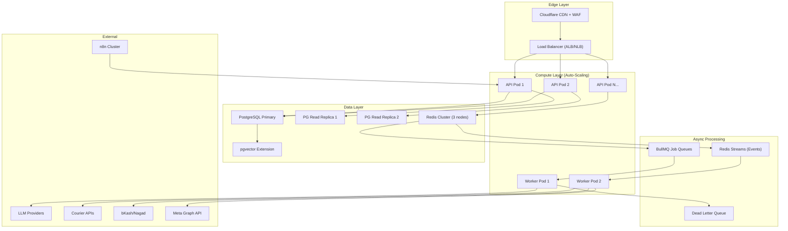

# CommerceOS — System Design & Scaling Analysis

## Executive Verdict

> [!CAUTION]
> **CommerceOS CANNOT handle 1 million users in its current implementation.** The architecture *documentation* (.agent/) is enterprise-grade, but the actual *code* has fundamental infrastructure gaps that would collapse under even modest production load (~100 concurrent users). However, the documented architecture is sound — the gap is between design and implementation.

---

## 1. What Was Reviewed

| Document | Path | Size |
|:--|:--|:--|
| Architecture | [ARCHITECTURE.md](file:///mnt/g/OLama/CommerceOS/.agent/ARCHITECTURE.md) | 8.4 KB |
| System Design | [SYSTEM_DESIGN.md](file:///mnt/g/OLama/CommerceOS/.agent/SYSTEM_DESIGN.md) | 6.8 KB |
| AI Architecture | [AI_ARCHITECTURE.md](file:///mnt/g/OLama/CommerceOS/.agent/AI_ARCHITECTURE.md) | 7.2 KB |
| Data Model | [DATA_MODEL.md](file:///mnt/g/OLama/CommerceOS/.agent/DATA_MODEL.md) | 28.6 KB |
| Event Architecture | [EVENT_ARCHITECTURE.md](file:///mnt/g/OLama/CommerceOS/.agent/EVENT_ARCHITECTURE.md) | 4.3 KB |
| Security | [SECURITY.md](file:///mnt/g/OLama/CommerceOS/.agent/SECURITY.md) | 6.1 KB |
| DevOps | [DEVOPS.md](file:///mnt/g/OLama/CommerceOS/.agent/DEVOPS.md) | 4.5 KB |
| n8n Architecture | [N8N_ARCHITECTURE.md](file:///mnt/g/OLama/CommerceOS/.agent/N8N_ARCHITECTURE.md) | 5.9 KB |
| RAG Architecture | [RAG_ARCHITECTURE.md](file:///mnt/g/OLama/CommerceOS/.agent/RAG_ARCHITECTURE.md) | 2.9 KB |
| Observability | [OBSERVABILITY.md](file:///mnt/g/OLama/CommerceOS/.agent/OBSERVABILITY.md) | 1.8 KB |
| Roadmap | [ROADMAP.md](file:///mnt/g/OLama/CommerceOS/.agent/ROADMAP.md) | 14.5 KB |
| API Contracts | [API_CONTRACTS.md](file:///mnt/g/OLama/CommerceOS/.agent/API_CONTRACTS.md) | 8.2 KB |
| MLOps | [MLOPS.md](file:///mnt/g/OLama/CommerceOS/.agent/MLOPS.md) | 1.7 KB |
| Source Code | [src/](file:///mnt/g/OLama/CommerceOS/src) | 531 files, ~100K+ LOC |
| Database Layer | [db/index.ts](file:///mnt/g/OLama/CommerceOS/src/infrastructure/db/index.ts) | 7,632 lines (276 KB) |

---

## 2. Architecture Documentation Score — ★★★★☆ (4/5)

The `.agent/` documentation describes a **legitimately well-designed** distributed system. Here's what's architecturally sound:

### ✅ Strong Design Decisions

| Aspect | Design | Verdict |
|:--|:--|:--|
| **Multi-Tenant Isolation** | `tenant_id` derived from JWT, never from request body | ✅ Industry standard |
| **Agent → Policy → API → DB** | LLMs never touch the database directly | ✅ Critical safety pattern |
| **Event-Driven Architecture** | Redis Streams with at-least-once delivery, DLQ, idempotent consumers | ✅ Scalable pattern |
| **Concurrency Control** | Redis distributed locks + PostgreSQL `FOR UPDATE` row locks | ✅ Correct for flash sales |
| **Webhook Security** | HMAC-SHA256, replay protection (<300s), `crypto.timingSafeEqual()` | ✅ Zero-trust ingress |
| **Idempotency** | Composite key `tenant_id:idempotency_key:operation` with 24h TTL | ✅ Prevents duplicate mutations |
| **Circuit Breakers** | 4-state machine (NORMAL→DEGRADED→OPEN→HALF_OPEN) per provider | ✅ Fault isolation |
| **Model Routing** | 3-tier LLM routing (Fast/Reasoning/Embedding) for cost optimization | ✅ Cost-effective at scale |
| **RBAC Matrix** | 7 roles, 28+ fine-grained permissions, `assertCan()` gatekeeper | ✅ Enterprise-ready |
| **Autonomy Budgets** | Daily spend limits, action caps, emergency kill switch | ✅ Safe AI autonomy |
| **Queue Topology** | 5 specialized queues with different concurrency and retry strategies | ✅ Backpressure-aware |

---

## 3. The Reality Gap — Documentation vs Implementation

> [!WARNING]
> **This is the single biggest risk.** The documentation describes PostgreSQL, Redis, pgvector, and distributed queues. The actual implementation uses **a single JSON file on disk** as its entire database.

### 🔴 Critical Finding: JSON File Database

```
Documented:   PostgreSQL 16 + pgvector + Redis 7 + Redis Streams
Actual:       .data/commerceos.json (single file, fs.writeFileSync)
```

**Evidence** from [db/index.ts](file:///mnt/g/OLama/CommerceOS/src/infrastructure/db/index.ts):

```typescript
// Line 513 — All data stored in a single JSON file
this.filePath = path.join(dataDir, "commerceos.json");

// Line 521 — Synchronous file read on startup
const raw = fs.readFileSync(this.filePath, "utf-8");

// Line 951 — Synchronous file write on every mutation
fs.writeFileSync(this.filePath, JSON.stringify(this.data, null, 2), "utf-8");
```

### What This Means at Scale

| Metric | Current (JSON File) | Required (1M Users) |
|:--|:--|:--|
| **Concurrent reads** | 1 (Node.js single-threaded sync) | 10,000+ |
| **Concurrent writes** | 1 (serialized, blocks event loop) | 5,000+ |
| **Data size limit** | ~50-100 MB before Node crashes | Terabytes |
| **ACID transactions** | ❌ None | ✅ Required |
| **Indexes** | ❌ None (linear scan on arrays) | ✅ B-tree, GiST, IVFFlat |
| **Replication** | ❌ Impossible | ✅ Multi-AZ replicas |
| **Point-in-time recovery** | ❌ Impossible | ✅ WAL archiving |
| **Row-level locking** | ❌ No locking | ✅ `FOR UPDATE` |
| **Vector search** | ❌ Not implemented | ✅ pgvector cosine |

---

## 4. Complete Gap Analysis — Current vs Million-User Ready

### 🔴 CRITICAL (Must Fix — System Will Fail)

| # | Gap | Current State | Required State | Effort |
|:--|:--|:--|:--|:--|
| 1 | **No real database** | JSON file on disk | PostgreSQL 16 + connection pool | 3-4 weeks |
| 2 | **No Redis** | Not installed | Redis 7 for cache, locks, pub/sub, queues | 2 weeks |
| 3 | **No vector search** | Not implemented | pgvector with IVFFlat/HNSW indexes | 1-2 weeks |
| 4 | **No connection pooling** | N/A | pgBouncer or built-in pg pool | 1 week |
| 5 | **No worker processes** | Everything in Next.js API routes | Separate worker services for queues | 2-3 weeks |
| 6 | **No horizontal scaling** | Single Node.js process | Multiple stateless API instances behind LB | 2 weeks |
| 7 | **No Docker deployment** | `npm run dev` only | Multi-stage Dockerfile, Docker Compose, K8s | 1-2 weeks |
| 8 | **No database migrations** | Seed data in code | Versioned SQL migrations (Drizzle/Knex) | 2 weeks |

### 🟡 IMPORTANT (Will Degrade Under Load)

| # | Gap | Current State | Required State |
|:--|:--|:--|:--|
| 9 | **No rate limiting** | Documented but not implemented at infra level | Redis-backed sliding window |
| 10 | **No CDN/edge caching** | Direct server requests | Cloudflare/Vercel Edge for static assets |
| 11 | **No APM/tracing** | Structured log schema defined, not wired | OpenTelemetry + Grafana/Datadog |
| 12 | **No load testing** | Zero load test scripts | k6/Artillery baseline benchmarks |
| 13 | **No health probes in practice** | Endpoints documented, basic impl | Deep health: DB pool, Redis, queue depths |
| 14 | **No real event bus** | Domain events are in-memory | Redis Streams consumer groups |
| 15 | **No background job processor** | n8n external only | BullMQ + Redis for internal jobs |
| 16 | **SSE/WebSocket at scale** | Not implemented | Redis pub/sub backed SSE |

### 🟢 GOOD (Already Well-Designed in Code)

| # | Strength | Evidence |
|:--|:--|:--|
| 17 | Domain-driven module structure | 27 domain directories, clean separation |
| 18 | Strict TypeScript + Zod validation | All API routes validated |
| 19 | API response envelope standard | Consistent `success/error/meta` format |
| 20 | RBAC permissions system | 21K+ LOC in [permissions.ts](file:///mnt/g/OLama/CommerceOS/src/lib/permissions.ts) |
| 21 | Comprehensive test coverage | 14 test suites, 223+ automated tests |
| 22 | Security utilities | JWT, HMAC, timing-safe compare in [security.ts](file:///mnt/g/OLama/CommerceOS/src/lib/security.ts) |
| 23 | Multi-agent architecture | 14 specialized agents with tool registries |
| 24 | n8n workflow catalog | 5 production JSON workflows, 39 templates |

---

## 5. Scaling Architecture for 1 Million Users

Here's the target architecture that would handle 1M+ users:



### Scaling Numbers Estimate (1M Monthly Active Users)

| Dimension | Target | Design Approach |
|:--|:--|:--|
| **Concurrent users** | 10,000-50,000 | Horizontal API pods + read replicas |
| **Orders/day** | 50,000-100,000 | PostgreSQL partitioning by tenant + date |
| **Messages/day** | 500,000-1,000,000 | Redis Streams + archival to cold storage |
| **AI agent runs/day** | 200,000-500,000 | Worker pool + model routing (Tier 1/2/3) |
| **Vector queries/day** | 100,000-300,000 | pgvector HNSW index + query cache |
| **Webhooks/day** | 1,000,000+ | Dedicated webhook ingress pods |
| **API latency P95** | < 200ms | Connection pooling + read replicas + Redis cache |
| **DB connections** | 500-1000 | pgBouncer transaction pooling |

---

## 6. Phased Migration Roadmap — From Prototype to Million-Scale

### Phase A: Foundation (Weeks 1-4) — 🔴 Critical

```
Week 1-2: PostgreSQL Migration
├── Install pg + drizzle-orm (or Prisma)
├── Create SQL migration files from DATA_MODEL.md schemas  
├── Build DatabaseClient class wrapping pg Pool
├── Migrate all db.data.* calls → SQL queries
├── Add connection pooling (pool.min=5, pool.max=50)
└── Tenant-scoped RLS policies

Week 3: Redis Integration
├── Install ioredis
├── Session cache (JWT → user context)
├── Rate limiting (sliding window)
├── Distributed locks (Redlock for inventory)
├── Pub/Sub for real-time updates
└── Idempotency key store (SETNX + TTL)

Week 4: Event Bus & Job Queues
├── Install BullMQ
├── Redis Streams for domain events  
├── Worker processes for async jobs
├── Dead letter queue handling
└── Retry strategies per queue
```

### Phase B: Horizontal Scaling (Weeks 5-8) — 🟡 Important

```
Week 5-6: Containerization & Orchestration
├── Multi-stage Dockerfile (builder + runner)
├── Docker Compose (app + pg + redis + n8n)
├── Kubernetes manifests (Deployment, Service, HPA)
├── Health check probes (/health/live, /health/ready)
└── Graceful shutdown handling

Week 7: Read/Write Splitting
├── PostgreSQL streaming replication
├── Read replica routing for GET endpoints
├── Write operations → primary only
├── Connection pool per replica
└── Monitoring replication lag

Week 8: CDN, Caching & Edge
├── Cloudflare or Vercel Edge deployment
├── Static asset caching (images, CSS, JS)
├── API response caching for catalog/product
├── Cache invalidation on mutations
└── Geographic edge routing (BD region)
```

### Phase C: Production Hardening (Weeks 9-12) — 🟢 Polish

```
Week 9-10: Observability
├── OpenTelemetry SDK integration
├── Distributed tracing (trace_id, span_id)
├── Structured JSON logging (as per OBSERVABILITY.md)
├── Grafana dashboards (4 golden signals)
├── Alert rules (P95 latency, 5xx rate, queue depth)
└── AI token cost monitoring

Week 11: Vector Search (RAG at Scale)
├── pgvector HNSW indexes (replacing IVFFlat)
├── Pre-filtered tenant-scoped ANN queries
├── Embedding cache (Redis) for frequent queries
├── Async document ingestion pipeline
└── Chunk deduplication

Week 12: Load Testing & Chaos
├── k6 load test scripts (target: 10K concurrent)
├── Stress test flash sale scenarios
├── Chaos testing (pod kill, DB failover)
├── Capacity planning documentation
└── Runbook for incident response
```

---

## 7. Database Migration Priority — The #1 Blocker

The single most impactful change is migrating from JSON file to PostgreSQL. Here's the specific migration path:

### Current `db.data.orders.filter(...)` Pattern
```typescript
// CURRENT — O(n) scan, no indexes, no ACID, blocks event loop
const orders = db.data.orders.filter(
  o => o.tenant_id === tenantId && o.status === 'CONFIRMED'
);
```

### Target PostgreSQL Pattern
```typescript
// TARGET — O(log n) index scan, ACID, non-blocking
const { rows } = await pool.query(
  `SELECT * FROM orders 
   WHERE tenant_id = $1 AND status = $2 
   ORDER BY created_at DESC 
   LIMIT $3 OFFSET $4`,
  [tenantId, 'CONFIRMED', limit, offset]
);
```

### Migration Scope
The [db/index.ts](file:///mnt/g/OLama/CommerceOS/src/infrastructure/db/index.ts) file is **7,632 lines** containing:
- ~60+ data arrays (tables)
- Hundreds of `.filter()`, `.find()`, `.push()`, `.splice()` operations
- Synchronous `fs.writeFileSync` after every write

This will require touching virtually every service file across the 27 domain directories.

---

## 8. Cost Estimation for 1M Users (Bangladesh Market)

| Component | Service | Monthly Cost (USD) |
|:--|:--|:--|
| **Database** | AWS RDS PostgreSQL (db.r6g.xlarge + 1 read replica) | $400-600 |
| **Redis** | AWS ElastiCache (cache.r6g.large, 3-node cluster) | $300-450 |
| **Compute** | AWS ECS/EKS (4-8 API pods, 2-4 worker pods) | $500-800 |
| **CDN** | Cloudflare Pro | $25 |
| **LLM API** | Gemini Flash + Sonnet (200K agent runs/day) | $800-2,000 |
| **n8n** | Self-hosted on ECS | $50-100 |
| **Monitoring** | Grafana Cloud or Datadog | $100-300 |
| **Bandwidth** | Data transfer (BD region) | $100-200 |
| **Total** | | **$2,275 - $4,475/mo** |

---

## 9. Summary Scorecard

| Dimension | Current Score | After Phase A | After Phase C (1M Ready) |
|:--|:--:|:--:|:--:|
| **Architecture Design** | ★★★★☆ | ★★★★☆ | ★★★★★ |
| **Implementation Maturity** | ★★☆☆☆ | ★★★★☆ | ★★★★★ |
| **Data Layer** | ★☆☆☆☆ | ★★★★☆ | ★★★★★ |
| **Horizontal Scalability** | ★☆☆☆☆ | ★★★☆☆ | ★★★★★ |
| **Observability** | ★☆☆☆☆ | ★★☆☆☆ | ★★★★☆ |
| **Security** | ★★★☆☆ | ★★★★☆ | ★★★★★ |
| **AI/Agent Safety** | ★★★★☆ | ★★★★☆ | ★★★★★ |
| **Production Readiness** | ★☆☆☆☆ | ★★★☆☆ | ★★★★★ |
| **Max Concurrent Users** | ~50-100 | ~5,000-10,000 | ~50,000+ |
| **Can Handle 1M MAU?** | ❌ No | ⚠️ With limits | ✅ Yes |

---

## 10. Recommended Immediate Next Steps

> [!IMPORTANT]
> **Priority 1**: Migrate the database from JSON file to PostgreSQL. This single change unblocks everything else. Without it, no other scaling investment matters.

1. **Install `pg` and `drizzle-orm`** (or Prisma) as dependencies
2. **Create SQL migration files** directly from [DATA_MODEL.md](file:///mnt/g/OLama/CommerceOS/.agent/DATA_MODEL.md) — the schemas are already production-ready
3. **Build a `DatabaseClient` wrapper** with connection pooling
4. **Progressively migrate** each domain service from `db.data.*` to SQL queries
5. **Install `ioredis`** for cache, locks, and pub/sub
6. **Create a Dockerfile** and `docker-compose.yml` with PostgreSQL + Redis containers

> [!TIP]
> The good news: the architecture documentation, domain modeling, API contracts, security model, event catalog, and multi-agent design are all solid. The codebase structure (27 domain modules, clean separation, Zod validation) is well-organized for migration. The gap is **infrastructure, not architecture**.
